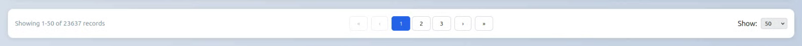
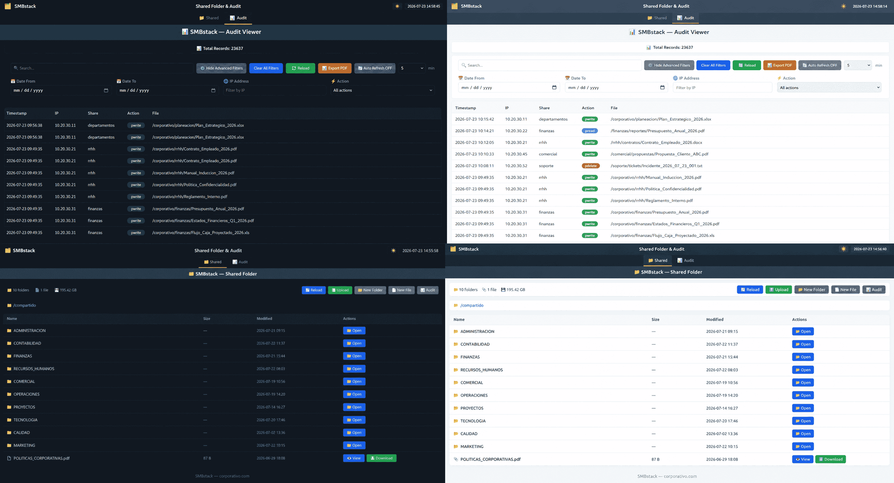
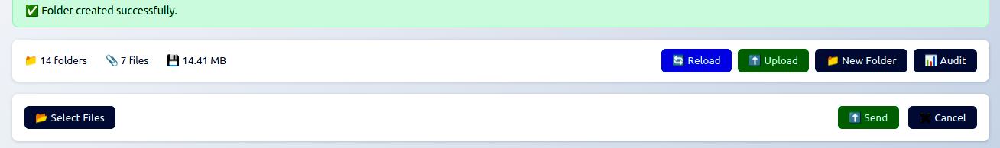

# [SMBstack](https://github.com/maravento)

[](https://github.com/maravento/smbstack)
[](https://github.com/maravento/smbstack)
[](https://github.com/maravento/smbstack/stargazers)
[](https://twitter.com/maraventostudio)

<!-- markdownlint-disable MD033 -->

<table>
  <tr>
    <td style="width: 50%; vertical-align: top;">
      <b>SMBstack</b> is an open-source Samba stack installer for Debian-based systems. It deploys a shared folder with Recycle Bin, full audit logging via rsyslog, a web-based audit viewer, and a shared folder browser — all configured interactively through a single installer script.
    </td>
    <td style="width: 50%; vertical-align: top;">
      <b>SMBstack</b> es un instalador de stack Samba de código abierto para sistemas basados en Debian. Despliega una carpeta compartida con Papelera de Reciclaje, auditoría completa vía rsyslog, un visor web de auditoría y un explorador web de la carpeta compartida — todo configurado de forma interactiva a través de un único script instalador.
    </td>
  </tr>
</table>

### Architecture

📐 [Runtime Architecture Diagram](https://htmlpreview.github.io/?https://raw.githubusercontent.com/maravento/smbstack/master/docs/smbstack-architecture.html) — visual walkthrough of the web/audit/recycle pipeline.

## REQUIREMENTS

---

**⚠️ WARNING:** Tested on Ubuntu 24.04/26.04 LTS. Use on other versions or distributions is at your own risk.

- Apache2 and PHP (`apache2`, `apache2-utils`, `libapache2-mod-php`, `php`)
- `rsyslog`, `logrotate`
- `acl`, `openssl`, `cron`, `iproute2`, `sudo`, `systemd`, `util-linux`, `zip` (checked by `smbsetup.sh`)
- `inotify-tools`, `procps`, `coreutils`, `findutils`, `cron`, `util-linux`, `sed`, `grep` (checked by `tools/smbwatch.sh`)
- `procps`, `samba`, `winbind`, `util-linux`, `coreutils`, `sed`, `systemd` (checked by `tools/smbload.sh`)
- `zip`, `coreutils`, `util-linux`, `cron` (checked by `tools/smbbk.sh`)

```bash
apt-get install -y apache2 apache2-utils libapache2-mod-php php rsyslog logrotate \
    acl openssl cron iproute2 sudo systemd util-linux sed grep inotify-tools \
    procps coreutils findutils zip
apt-get install -y --reinstall apache2-doc
```

The Samba packages (`samba`, `samba-common`, `samba-common-bin`, `smbclient`, `winbind`, `cifs-utils`) are installed by `smbsetup.sh` itself.

<table>
  <tr>
    <td style="width: 50%; vertical-align: top;">
      <strong>Important</strong>
      <ul>
        <li>nginx must not be running.</li>
        <li>SMBstack uses Apache2 exclusively on port 3092, because it is listed as <strong>Unassigned</strong> by IANA. For more information visit <a href="https://www.iana.org/assignments/service-names-port-numbers/service-names-port-numbers.txt">https://www.iana.org/assignments/service-names-port-numbers/service-names-port-numbers.txt</a></li>
      </ul>
    </td>
    <td style="width: 50%; vertical-align: top;">
      <strong>Importante</strong>
      <ul>
        <li>nginx no debe estar en ejecución.</li>
        <li>SMBstack usa Apache2 exclusivamente en el puerto 3092, ya que está listado como <strong>Sin asignar</strong> por IANA. Para más información visita <a href="https://www.iana.org/assignments/service-names-port-numbers/service-names-port-numbers.txt">https://www.iana.org/assignments/service-names-port-numbers/service-names-port-numbers.txt</a></li>
      </ul>
    </td>
  </tr>
</table>

## WEB INTERFACE

---

### Main Menu

[](https://github.com/maravento/smbstack)

<table>
  <tr>
    <td style="width: 50%; vertical-align: top;">
      There are two ways to reach each view: <code>http://localhost:3092/?tab=audit</code> or <code>http://localhost:3092/audit</code> for the audit viewer, and <code>http://localhost:3092/?tab=shared</code> or <code>http://localhost:3092/shared</code> for the shared folder browser. Both forms are valid.
    </td>
    <td style="width: 50%; vertical-align: top;">
      Hay dos maneras de llegar a cada vista: <code>http://localhost:3092/?tab=audit</code> o <code>http://localhost:3092/audit</code> para el visor de auditoría, y <code>http://localhost:3092/?tab=shared</code> o <code>http://localhost:3092/shared</code> para el explorador de carpeta compartida. Ambas formas son válidas.
    </td>
  </tr>
</table>

### SMBaudit

<table>
  <tr>
    <td style="width: 50%; vertical-align: top;">
      <p>The audit viewer (<code>http://localhost:3092/?tab=audit</code>) displays Samba activity logs in real time. It allows filtering by date range, IP and action, free-text search, pagination, and export to PDF.</p>
      <p>Records are paginated (50/100/200/500 per page) with page navigation, so large audit logs stay responsive.</p>
    </td>
    <td style="width: 50%; vertical-align: top;">
      <p>El visor de auditoría (<code>http://localhost:3092/?tab=audit</code>) muestra los logs de actividad de Samba en tiempo real. Permite filtrar por rango de fechas, IP y acción, búsqueda de texto libre, paginación, y exportación a PDF.</p>
      <p>Los registros están paginados (50/100/200/500 por página) con navegación entre páginas, para que los logs de auditoría extensos se mantengan ágiles.</p>
    </td>
  </tr>
</table>

[](https://github.com/maravento/smbstack)

### SMBshared

<table>
  <tr>
    <td style="width: 50%; vertical-align: top;">
      <p>The shared folder browser (<code>http://localhost:3092/</code>) provides a unified interface with two tabs: <strong>Shared</strong> and <strong>Audit</strong>. The Shared tab allows navigating the shared folder structure, opening or downloading documents, and moving items to the recycle bin. Root-level folders are protected — items cannot be uploaded, created, or deleted from the root level.</p>
      <p>Both views support a light/dark theme toggle from the top bar, synced across tabs.</p>
    </td>
    <td style="width: 50%; vertical-align: top;">
      <p>El explorador de carpeta compartida (<code>http://localhost:3092/</code>) ofrece una interfaz unificada con dos pestañas: <strong>Shared</strong> y <strong>Audit</strong>. La pestaña Shared permite navegar la estructura de carpetas, abrir o descargar documentos y mover elementos a la papelera de reciclaje. Las carpetas de primer nivel están protegidas — no se pueden subir archivos, crear carpetas ni eliminar elementos desde la raíz.</p>
      <p>Ambas vistas admiten un interruptor de tema claro/oscuro desde la barra superior, sincronizado entre pestañas.</p>
    </td>
  </tr>
</table>

[](https://github.com/maravento/smbstack)

<table>
  <tr>
    <td style="width: 50%; vertical-align: top;">
      <ul>
        <li>Inside any subfolder, the toolbar allows uploading single or multiple files simultaneously, creating new folders, and reloading the view. All operations are recorded in the audit log with the client's IP address.</li>
        <li>Images and PDF files can be previewed inline via a modal (<strong>Preview</strong> button) without downloading them. Other file types keep the <strong>View</strong> button, which opens the file in a new tab.</li>
        <li>Files can also be uploaded by dragging and dropping them onto the upload panel, in addition to the file selector. A progress bar tracks the upload in real time.</li>
        <li>SMBstack is installable as a Progressive Web App (PWA) on Chrome, Edge, and Safari (iOS/macOS), including offline access to the app shell. <strong>Firefox Desktop does not support PWA installation</strong> (removed since Firefox 85) — the app still works normally in the browser, just without the native install prompt.</li>
      </ul>
    </td>
    <td style="width: 50%; vertical-align: top;">
      <ul>
        <li>Dentro de cualquier subcarpeta, la barra de herramientas permite subir uno o varios archivos simultáneamente, crear nuevas carpetas y recargar la vista. Todas las operaciones quedan registradas en el log de auditoría con la IP del cliente.</li>
        <li>Las imágenes y archivos PDF pueden previsualizarse en un modal (botón <strong>Preview</strong>) sin necesidad de descargarlos. El resto de tipos de archivo conserva el botón <strong>View</strong>, que abre el archivo en una nueva pestaña.</li>
        <li>Los archivos también pueden subirse arrastrándolos y soltándolos sobre el panel de subida, además del selector de archivos. Una barra de progreso muestra el avance de la subida en tiempo real.</li>
        <li>SMBstack es instalable como Progressive Web App (PWA) en Chrome, Edge y Safari (iOS/macOS), incluyendo acceso sin conexión al shell de la app. <strong>Firefox Desktop no soporta instalación de PWA</strong> (eliminado desde Firefox 85) — la app sigue funcionando con normalidad en el navegador, solo sin el aviso nativo de instalación.</li>
      </ul>
    </td>
  </tr>
</table>

[](https://github.com/maravento/smbstack)

## SCOPE

---

<table>
  <tr>
    <td style="width: 50%; vertical-align: top;">
      <b>What SMBstack does:</b>
      <ul>
        <li>Installs and configures Samba with a shared folder, Recycle Bin and group permissions</li>
        <li>Configures full audit logging via rsyslog to <code>/var/log/samba/log.audit</code></li>
        <li>Deploys a web-based audit log viewer at <code>http://localhost:3092/?tab=audit</code></li>
        <li>Deploys a web-based shared folder browser at <code>http://localhost:3092/?tab=shared</code></li>
        <li>Configures logrotate for all Samba logs</li>
        <li>Installs a service watchdog (<code>smbload.sh</code>) via cron every 5 minutes</li>
        <li>Installs a shared folder size monitor (<code>smbwatch.sh</code>) — self-managed, independent of the installer</li>
        <li>Provides a configuration backup tool (<code>smbbk.sh</code>) with monthly cron support</li>
        <li>Saves installation config to <code>/var/www/smbstack/smbstack.env</code> for future updates</li>
        <li>NetBIOS disabled by default (enable manually if needed, see the NetBIOS section)</li>
      </ul>
    </td>
    <td style="width: 50%; vertical-align: top;">
      <b>Lo que SMBstack hace:</b>
      <ul>
        <li>Instala y configura Samba con carpeta compartida, Papelera de Reciclaje y permisos de grupo</li>
        <li>Configura auditoría completa vía rsyslog en <code>/var/log/samba/log.audit</code></li>
        <li>Despliega un visor web de auditoría en <code>http://localhost:3092/?tab=audit</code></li>
        <li>Despliega un explorador web de la carpeta compartida en <code>http://localhost:3092/?tab=shared</code></li>
        <li>Configura logrotate para todos los logs de Samba</li>
        <li>Instala un watchdog de servicios (<code>smbload.sh</code>) vía cron cada 5 minutos</li>
        <li>Instala un monitor de espacio de la carpeta compartida (<code>smbwatch.sh</code>) — autogestionado, independiente del instalador</li>
        <li>Provee una herramienta de respaldo de configuración (<code>smbbk.sh</code>) con soporte de cron mensual</li>
        <li>Guarda la configuración de instalación en <code>/var/www/smbstack/smbstack.env</code> para futuras actualizaciones</li>
        <li>NetBIOS deshabilitado por defecto (actívalo manualmente si lo necesitas, ver la sección NetBIOS)</li>
      </ul>
    </td>
  </tr>
  <tr>
    <td style="width: 50%; vertical-align: top;">
      <b>Out of scope (not implemented):</b>
      <ul>
        <li>Active Directory / domain controller</li>
        <li>Multiple shared folders</li>
        <li>Custom paths outside <code>/home/$local_user/</code> (must be edited manually)</li>
        <li>IPv6</li>
        <li>LDAP</li>
      </ul>
    </td>
    <td style="width: 50%; vertical-align: top;">
      <b>Fuera de alcance (no implementado):</b>
      <ul>
        <li>Active Directory / controlador de dominio</li>
        <li>Múltiples carpetas compartidas</li>
        <li>Rutas personalizadas fuera de <code>/home/$local_user/</code> (debe editarse manualmente)</li>
        <li>IPv6</li>
        <li>LDAP</li>
      </ul>
    </td>
  </tr>
</table>

## REPOSITORY STRUCTURE

---

```
smbstack/
├── acl/                         # Static access-control lists for Samba
│   └── commonveto.txt              # Veto list for common unwanted file types (active by default in smb.conf)
│
├── conf/                        # Samba and rsyslog configuration
│   ├── fullaudit.conf              # rsyslog full audit rule
│   └── smb.conf                    # Samba main config (placeholders: your_user, compartida)
│
├── tools/                      # Background watchdog and maintenance scripts
│   ├── smbbk.sh                    # Configuration backup for smbstack
│   ├── smbload.sh                  # Service watchdog (smbd + winbind + smbwatch)
│   └── smbwatch.sh                 # Shared folder size monitor (self-managed)
│
├── web/                        # Web front-end for the audit log viewer and shared-folder browser
│   ├── icon.svg                    # PWA / apple-touch icon
│   ├── index.php                   # Main page (Audit / Shared tabs)
│   ├── manifest.json               # PWA manifest
│   ├── shared.php                  # Shared folder dynamic browser
│   ├── smbapi.php                  # Audit log reader API
│   ├── smbaudit-diagnostic.php     # Audit log diagnostic tool
│   ├── smbaudit.html               # Audit log viewer UI
│   ├── smbweb.conf                 # Apache vhost (:3092/?tab=audit and :3092/?tab=shared)
│   └── sw.js                       # PWA service worker (app-shell cache only)
│
└── smbsetup.sh                 # Installer: install, update, uninstall, status
```

<table>
  <tr>
    <td style="width: 50%; vertical-align: top;">
      Files and directories generated at runtime (not included in the repository):
    </td>
    <td style="width: 50%; vertical-align: top;">
      Archivos y directorios generados en runtime (no incluidos en el repositorio):
    </td>
  </tr>
</table>

```
/var/www/smbstack/
├── .size_cache/                # Folder size cache used by shared.php (www-data, created by the installer)
├── tools/                      # Deployed copy of tools/*.sh
├── web/                        # Deployed copy of web/ (served by Apache on :3092)
└── smbstack.env                # Saved install config (user, paths, network, trusted proxies, watch limit, max log lines)

/etc/bak/smbstack/              # Archives written by tools/smbbk.sh (smbbk_<YYYYMMDD_HHMM>.zip, last 3 kept),
                                 # run by --update before overwriting application code, and by its own monthly cron
/etc/bak/crontab/root.bak       # Copy of root's crontab, taken before any cron entry is added or removed

/var/log/smbwatch.log           # smbwatch.sh runtime log (root:root, 640)
/var/log/smbload.log            # smbload.sh runtime log

/home/$local_user/shared/       # Shared folder (independent of the installer)
├── .recycle/                   # Recycle Bin (smbguest/, www-data/, smbwatch/)
└── DEMO/                       # Demo folder

/etc/logrotate.d/samba          # Generated by installer (heredoc)
/etc/logrotate.d/smbwatch       # Generated by installer (heredoc), rotates /var/log/smbwatch.log
/var/log/samba/log.audit        # Created by rsyslog
/var/log/samba/log.samba        # Created by installer, written directly by smbd

/etc/samba/acl/commonveto.txt   # Copied from acl/commonveto.txt by the installer
```

> Before adding or removing any cron entry, `smbsetup.sh`, `tools/smbwatch.sh` and `tools/smbbk.sh` copy root's crontab to `/etc/bak/crontab/root.bak`.
>
> It is a single copy, overwritten on every run and shared with every other project that touches the same crontab. It is never restored automatically.
>
> `--uninstall` does not restore it either. It deletes only its own entries, matched by the full script path, and leaves every other cron job untouched.
>
> To roll back, restore the copy by hand with `crontab /etc/bak/crontab/root.bak`.
>
> Antes de agregar o quitar cualquier entrada de cron, `smbsetup.sh`, `tools/smbwatch.sh` y `tools/smbbk.sh` copian el crontab de root en `/etc/bak/crontab/root.bak`.
>
> Es una sola copia, sobrescrita en cada ejecución y compartida con cualquier otro proyecto que toque el mismo crontab. Nunca se restaura de forma automática.
>
> `--uninstall` tampoco la restaura. Borra únicamente sus propias entradas, identificadas por la ruta completa del script, y deja intactas las demás tareas de cron.
>
> Para deshacer un cambio, restaure la copia a mano con `crontab /etc/bak/crontab/root.bak`.

## HOW TO USE

---

### Install

<table>
  <tr>
    <td style="width: 50%; vertical-align: top;">
      Download the repository and run the installer:
    </td>
    <td style="width: 50%; vertical-align: top;">
      Descarga el repositorio y ejecuta el instalador:
    </td>
  </tr>
</table>

```bash
git clone --depth=1 https://github.com/maravento/smbstack.git
cd smbstack
sudo bash smbsetup.sh
# or, to skip the menu and install directly | o, para saltar el menú e instalar directamente
sudo bash smbsetup.sh --install
```

<table>
  <tr>
    <td style="width: 50%; vertical-align: top;">
      The installer will prompt for:
    </td>
    <td style="width: 50%; vertical-align: top;">
      El instalador preguntará por:
    </td>
  </tr>
</table>

| Prompt | Description | Descripción |
|--------|-------------|-------------|
| Shared folder name | Name for the shared folder (created under `/home/$local_user/`) | Nombre de la carpeta compartida (creada bajo `/home/$local_user/`) |
| Network interface | Selected from available interfaces listed. The Samba network is derived from its address and prefix | Seleccionada de las interfaces disponibles listadas. La red de Samba se deriva de su dirección y prefijo |
| Samba username | Samba account to create | Cuenta de Samba a crear |
| Overwrite smb.conf | Only asked if `/etc/samba/smb.conf` already exists | Solo se pregunta si `/etc/samba/smb.conf` ya existe |

<table>
  <tr>
    <td style="width: 50%; vertical-align: top;">
      <p>Set <code>SMBSTACK_IFACE</code> to skip the interface prompt (e.g. <code>SMBSTACK_IFACE=eth1 sudo bash smbsetup.sh --install</code>). Another installer deploying SMBstack uses this to pass the interface it already knows.</p>
      <p><code>$local_user</code> is the local Linux user detected automatically by the installer. <br>
      <br>
      The installer looks at the users within the system's normal UID range, taken from <code>UID_MIN</code> and <code>UID_MAX</code> in <code>/etc/login.defs</code>, excluding those with a <code>/false</code> or <code>/nologin</code> shell. Among those who belong to the <code>sudo</code> group, it selects the one with the lowest UID. <br>
      <br>
      That user becomes the owner of the shared folder and the base name for the Samba account.</p>
    </td>
    <td style="width: 50%; vertical-align: top;">
      <p>Define <code>SMBSTACK_IFACE</code> para omitir la pregunta de interfaz (ej. <code>SMBSTACK_IFACE=eth1 sudo bash smbsetup.sh --install</code>). Otro instalador que despliegue SMBstack usa esto para pasar la interfaz que ya conoce.</p>
      <p><code>$local_user</code> es el usuario local de Linux detectado automáticamente por el instalador. <br>
      <br>
      El instalador revisa los usuarios dentro del rango normal de UID, tomado de <code>UID_MIN</code> y <code>UID_MAX</code> en <code>/etc/login.defs</code>, excluyendo a los que tienen shell <code>/false</code> o <code>/nologin</code>. Entre los que pertenecen al grupo <code>sudo</code>, selecciona el de UID más bajo. <br>
      <br>
      Ese usuario pasa a ser el propietario de la carpeta compartida y el nombre base de la cuenta de Samba.</p>
    </td>
  </tr>
</table>

### Update & Uninstall

<table>
  <tr>
    <td style="width: 50%; vertical-align: top;">
      To update or uninstall SMBstack, download the updated repository, enter the folder and run:
    </td>
    <td style="width: 50%; vertical-align: top;">
      Para actualizar o desinstalar SMBstack, descarga el repositorio actualizado, entra a la carpeta y ejecuta:
    </td>
  </tr>
</table>

```bash
cd smbstack
sudo bash smbsetup.sh --update
# or | o
sudo bash smbsetup.sh --uninstall
```

| File | `--update` | `--uninstall` |
|------|-----------|---------------|
| `conf/smb.conf` | ⛔ not touched (user-customized) | ✅ restored from `.bak` if it exists (only created when the installer overwrote a pre-existing `smb.conf`; on a fresh install, no `.bak` exists and `smb.conf` is left untouched) |
| `conf/fullaudit.conf` | ⛔ not touched (user-customized) | ✅ removed |
| `web/smbweb.conf` | ⛔ not touched (user-customized) | ✅ removed |
| `web/index.php` | ✅ overwritten | ✅ removed |
| `web/smbaudit.html` | ✅ overwritten | ✅ removed |
| `web/smbapi.php` | ✅ overwritten | ✅ removed |
| `web/smbaudit-diagnostic.php` | ✅ overwritten | ✅ removed |
| `web/shared.php` | ✅ overwritten | ✅ removed |
| `web/manifest.json` | ✅ overwritten | ✅ removed |
| `web/sw.js` | ✅ overwritten | ✅ removed |
| `web/icon.svg` | ✅ overwritten | ✅ removed |
| `tools/smbbk.sh` | ✅ overwritten | ✅ removed (its cron entry is deregistered first) |
| `tools/smbload.sh` | ✅ overwritten | ✅ removed |
| `tools/smbwatch.sh` | ✅ overwritten | ✅ removed |
| `/var/www/smbstack/smbstack.env` | ⛔ preserved | ✅ removed |
| Shared folder (`/home/$local_user/shared/`) | ⛔ never touched | ⛔ never touched |

> The shared folder is independent of the installer. To remove it, do so manually: `rm -rf /home/$local_user/shared`
>
> La carpeta compartida es independiente del instalador. Para eliminarla, hazlo manualmente: `rm -rf /home/$local_user/shared`

<table>
  <tr>
    <td style="width: 50%; vertical-align: top;">
      <code>--update</code> calls <code>tools/smbbk.sh</code> before overwriting anything, which writes a full backup to <code>/etc/bak/smbstack</code>. <br>
      <br>
      It only refreshes the application code: the web PHP and HTML viewers and <code>tools/*.sh</code>. <br>
      <br>
      The configuration files deployed at install time, <code>smb.conf</code>, <code>fullaudit.conf</code> and <code>smbweb.conf</code>, are never overwritten, since they may contain manual edits such as custom shares, <code>hosts allow</code> or interfaces. <br>
      <br>
      To pick up changes to those files after an update, compare them by hand against <code>conf/</code> and <code>web/smbweb.conf</code> in the repository and apply the changes yourself.
    </td>
    <td style="width: 50%; vertical-align: top;">
      <code>--update</code> llama a <code>tools/smbbk.sh</code> antes de sobrescribir nada, que escribe una copia completa en <code>/etc/bak/smbstack</code>. <br>
      <br>
      Solo actualiza el código de la aplicación: los visores web en PHP y HTML y <code>tools/*.sh</code>. <br>
      <br>
      Los archivos de configuración desplegados en la instalación, <code>smb.conf</code>, <code>fullaudit.conf</code> y <code>smbweb.conf</code>, nunca se sobrescriben, ya que pueden contener ediciones manuales como shares personalizados, <code>hosts allow</code> o interfaces. <br>
      <br>
      Para incorporar cambios de esos archivos tras una actualización, compárelos a mano contra <code>conf/</code> y <code>web/smbweb.conf</code> en el repositorio y aplique los cambios usted mismo.
    </td>
  </tr>
</table>

### Status

```bash
sudo bash smbsetup.sh --status
```

<table>
  <tr>
    <td style="width: 50%; vertical-align: top;">
      Shows: smbd and winbind service status, Apache port 3092, last 5 audit log entries, and <code>testparm</code> summary.
    </td>
    <td style="width: 50%; vertical-align: top;">
      Muestra: estado de los servicios smbd y winbind, el puerto 3092 de Apache, las últimas 5 entradas del log de auditoría, y un resumen de <code>testparm</code>.
    </td>
  </tr>
</table>

### Config

<table>
  <tr>
    <td style="width: 50%; vertical-align: top;">
      After installation, the main configuration files are:
    </td>
    <td style="width: 50%; vertical-align: top;">
      Tras la instalación, los archivos de configuración principales son:
    </td>
  </tr>
</table>

| Description | File |
|-------------|------|
| Samba main config | `/etc/samba/smb.conf` |
| Audit rsyslog rule | `/etc/rsyslog.d/fullaudit.conf` |
| Web vhost (audit + shared) | `/etc/apache2/sites-available/smbweb.conf` |
| Log rotation (Samba logs) | `/etc/logrotate.d/samba` |
| Log rotation (`smbwatch.sh`) | `/etc/logrotate.d/smbwatch` |
| Install config | `/var/www/smbstack/smbstack.env` |

<table>
  <tr>
    <td style="width: 50%; vertical-align: top;">
      <code>smbstack.env</code> sets <code>TRUSTED_PROXIES="127.0.0.1"</code> by default. <br>
      <br>
      It tells <code>web/shared.php</code> to use the <code>CF-Connecting-IP</code> or <code>X-Forwarded-For</code> header, when present, instead of <code>REMOTE_ADDR</code>, for requests arriving from localhost. This way the loopback connection of a local tunnel is not recorded as the client in the audit log. <br>
      <br>
      It has no effect on direct LAN access.
    </td>
    <td style="width: 50%; vertical-align: top;">
      <code>smbstack.env</code> establece <code>TRUSTED_PROXIES="127.0.0.1"</code> por defecto. <br>
      <br>
      Le indica a <code>web/shared.php</code> que use el encabezado <code>CF-Connecting-IP</code> o <code>X-Forwarded-For</code>, cuando esté presente, en lugar de <code>REMOTE_ADDR</code>, para las solicitudes que llegan desde localhost. Así la conexión loopback de un túnel local no se registra como el cliente en el log de auditoría. <br>
      <br>
      No tiene efecto en el acceso directo desde la LAN.
    </td>
  </tr>
</table>

```bash
# Verify Samba config | Verificar configuración de Samba
testparm

# Restart services | Reiniciar servicios
sudo systemctl restart smbd winbind

# View audit log | Ver log de auditoría
tail -f /var/log/samba/log.audit

# List Samba users | Listar usuarios de Samba
sudo pdbedit -L
```

<table>
  <tr>
    <td style="width: 50%; vertical-align: top;">
      To use a custom shared folder path outside <code>/home/$local_user/</code>, edit <code>/etc/samba/smb.conf</code> and <code>/etc/apache2/sites-available/smbweb.conf</code> manually after installation.
    </td>
    <td style="width: 50%; vertical-align: top;">
      Para usar una ruta de carpeta compartida personalizada fuera de <code>/home/$local_user/</code>, edita <code>/etc/samba/smb.conf</code> y <code>/etc/apache2/sites-available/smbweb.conf</code> manualmente tras la instalación.
    </td>
  </tr>
</table>

### Recycle Bin

<table>
  <tr>
    <td style="width: 50%; vertical-align: top;">
      SMBstack uses the Samba <code>vfs_recycle</code> module to redirect file deletions to a hidden recycle bin instead of permanently removing them. The bin is stored inside the shared folder under <code>.recycle/</code>.
    </td>
    <td style="width: 50%; vertical-align: top;">
      SMBstack usa el módulo <code>vfs_recycle</code> de Samba para redirigir las eliminaciones a una papelera de reciclaje oculta en lugar de borrar permanentemente los archivos. La papelera se almacena dentro de la carpeta compartida en <code>.recycle/</code>.
    </td>
  </tr>
</table>

#### Recycle bin channels

<table>
  <tr>
    <td style="width: 50%; vertical-align: top;">
      SMBstack writes to the recycle bin through three independent channels, each operating under a different system context:
    </td>
    <td style="width: 50%; vertical-align: top;">
      SMBstack escribe en la papelera de reciclaje a través de tres canales independientes, cada uno operando bajo un contexto de sistema diferente:
    </td>
  </tr>
</table>

| Path | Written by | Purpose | Propósito |
|---|---|---|---|
| `.recycle/smbguest/` | SMB clients on the LAN, through `vfs_recycle` (`smbguest`, set by `force user` in `smb.conf`) | Holds files deleted by users from Windows or Linux over the network | Guarda los archivos borrados por los usuarios desde Windows o Linux por la red |
| `.recycle/www-data/` | The web interface running under Apache (`www-data`) | Holds files deleted from the browser panel | Guarda los archivos borrados desde el panel web |
| `.recycle/smbwatch/` | `tools/smbwatch.sh` (`${LOCAL_USER:-root}:sambashare`) | Holds files moved out automatically when a monitored folder exceeds its size limit | Guarda los archivos retirados automáticamente cuando una carpeta monitoreada supera su límite de tamaño |

<table>
  <tr>
    <td style="width: 50%; vertical-align: top;">
      This is why the recycle bin directory contains one subdirectory per channel:
    </td>
    <td style="width: 50%; vertical-align: top;">
      Por eso el directorio de la papelera contiene un subdirectorio por canal:
    </td>
  </tr>
</table>

```
.recycle/
├── smbguest/               # Files deleted by Windows/Linux SMB clients on the LAN
│   └── DOCUMENTS/
│       ├── report.docx
│       └── Copy #1 of report.docx
├── www-data/               # Files deleted via the web browser interface
│   └── 20260623/
│       └── invoice.pdf
└── smbwatch/               # Files auto-moved by the size-limit watchdog
    └── 20260711/
        └── bigfile.iso
```

> **Note:** the recycle bin lives inside the shared folder itself so that recycling a file is a `mv` within the same filesystem — instantaneous and without copying data, which would not be the case if the bin were on another disk. For the details of each channel, see the *Web Interface*, *smbwatch* and *Configuration reference* sections.

> **Nota:** la papelera vive dentro de la propia carpeta compartida para que reciclar un archivo sea un `mv` dentro del mismo sistema de archivos — instantáneo y sin copiar datos, cosa que no ocurriría si la papelera estuviera en otro disco. Para el detalle de cada canal, consulta las secciones *Web Interface*, *smbwatch* y *Configuration reference*.

#### Recycle timestamp

<table>
  <tr>
    <td style="width: 50%; vertical-align: top;">
      The weekly cleanup decides what to delete by reading each item's modification date, so that date must reflect the moment the item was recycled — not the day the document was last edited. Otherwise an old file recycled today would already count as expired and disappear on the next run. Each channel stamps the item with the current date on its way into the bin:
    </td>
    <td style="width: 50%; vertical-align: top;">
      La limpieza semanal decide qué borrar leyendo la fecha de modificación de cada elemento, así que esa fecha debe reflejar el momento en que se recicló, no el día en que se editó el documento por última vez. De lo contrario, un archivo antiguo reciclado hoy ya contaría como vencido y desaparecería en la siguiente pasada. Cada canal sella el elemento con la fecha actual al entrar en la papelera:
    </td>
  </tr>
</table>

| Channel | Stamped by |
|---------|------------|
| SMB (LAN clients) | `recycle:touch = yes` in `smb.conf` |
| Web interface (Apache) | `recycle_touch()` in `web/shared.php`, applied recursively so a recycled folder carries its contents |
| Size-limit watchdog | `touch` after the move, in `tools/smbwatch.sh` |

> A restored item therefore carries the date it was recycled, not its original one.
>
> Por eso un elemento restaurado conserva la fecha en que fue reciclado, no la original.

#### File versioning

<table>
  <tr>
    <td style="width: 50%; vertical-align: top;">
      When <code>recycle:versions = yes</code> is active, deleting a file that already exists in the recycle bin does not overwrite it — the new copy is saved alongside the original with a <code>Copy #N of</code> prefix:
    </td>
    <td style="width: 50%; vertical-align: top;">
      Cuando <code>recycle:versions = yes</code> está activo, eliminar un archivo que ya existe en la papelera no lo sobreescribe — la nueva copia se guarda junto a la original con el prefijo <code>Copy #N of</code>:
    </td>
  </tr>
</table>

```
.recycle/smbguest/DOCUMENTS/
├── report.docx             ← first deletion
└── Copy #1 of report.docx  ← second deletion of the same file
```

<table>
  <tr>
    <td style="width: 50%; vertical-align: top;">
      To exclude specific file types from versioning, use <code>recycle:noversions</code>. These types are still recycled, but repeated deletions <strong>overwrite</strong> the previous copy in the bin rather than creating a numbered duplicate:
    </td>
    <td style="width: 50%; vertical-align: top;">
      Para excluir tipos de archivo del versionado, usa <code>recycle:noversions</code>. Estos archivos siguen yendo a la papelera, pero eliminaciones repetidas <strong>sobreescriben</strong> la copia anterior en lugar de crear una nueva numerada:
    </td>
  </tr>
</table>

```ini
# All files keep multiple versions:
recycle:versions = yes

# These types are recycled but NOT versioned — second delete overwrites the first:
recycle:noversions = *.dat,*.ini
```

<table>
  <tr>
    <td style="width: 50%; vertical-align: top;">
      Use <code>noversions</code> for files where accumulating copies adds no value: runtime data files, config dumps, ini snapshots, and similar.
    </td>
    <td style="width: 50%; vertical-align: top;">
      Usa <code>noversions</code> para archivos donde acumular copias no aporta valor: archivos de datos en tiempo de ejecución, volcados de configuración, snapshots de ini y similares.
    </td>
  </tr>
</table>

#### Configuration reference

| Parameter | Value | Purpose | Propósito |
|-----------|-------|---------|-----------|
| `recycle:repository` | `.recycle/%U` | SMB channel recycle bin, resolves to `smbguest` | Papelera del canal SMB, resuelve a `smbguest` |
| `recycle:directory_mode` | `0775` | Group-writable recycle directory | Directorio escribible por el grupo |
| `recycle:keeptree` | `yes` | Preserve original folder structure | Preservar estructura de carpetas |
| `recycle:versions` | `yes` | Keep multiple versions of deleted files | Mantener múltiples versiones |
| `recycle:noversions` | `*.dat,*.ini` | Exclude patterns from versioning | Excluir patrones del versionado |
| `recycle:touch` | `yes` | Update access time when recycled | Actualizar tiempo de acceso al reciclar |
| `recycle:exclude` | `*.tmp,*.temp,*.o,…` | Permanently delete matching files | Eliminar permanentemente archivos que coincidan |
| `recycle:exclude_dir` | `/temp,/tmp,/cache,/.Trash-1000` | Bypass recycle bin for directories | Omitir papelera para directorios |
| `recycle:maxsize` | `1073741824` | Max file size (1 GB) | Tamaño máximo (1 GB) |
| `hide files` | `/.recycle/` | Hide recycle directory from clients | Ocultar papelera a los clientes |

#### Automatic cleanup

<table>
  <tr>
    <td style="width: 50%; vertical-align: top;">
      The installer registers a weekly cron job (under <code>root</code>) that removes recycled files older than 7 days:
    </td>
    <td style="width: 50%; vertical-align: top;">
      El instalador registra una tarea cron semanal (bajo <code>root</code>) que elimina los archivos reciclados con más de 7 días de antigüedad:
    </td>
  </tr>
</table>

```bash
@weekly find "/home/$local_user/shared/.recycle/" -depth -mindepth 1 -mtime +6 -delete >/dev/null 2>&1
```

> The job runs once a week, so an item stays in the bin between 7 and 13 days depending on the day it was recycled.
>
> La tarea corre una vez por semana, así que un elemento permanece en la papelera entre 7 y 13 días según el día en que se recicló.

<table>
  <tr>
    <td style="width: 50%; vertical-align: top;">
      To adjust the retention period or inspect the entry:
    </td>
    <td style="width: 50%; vertical-align: top;">
      Para ajustar el período de retención o inspeccionar la entrada:
    </td>
  </tr>
</table>

```bash
sudo crontab -e
```

---

### Full Audit

<table>
  <tr>
    <td style="width: 50%; vertical-align: top;">
      SMBstack uses the Samba <code>vfs_full_audit</code> module to log file operations to <code>/var/log/samba/log.audit</code> via rsyslog. Only successful operations are recorded; failures are suppressed to keep the log clean.
    </td>
    <td style="width: 50%; vertical-align: top;">
      SMBstack usa el módulo <code>vfs_full_audit</code> de Samba para registrar operaciones de archivos en <code>/var/log/samba/log.audit</code> vía rsyslog. Solo se registran operaciones exitosas; los fallos se suprimen para mantener el log limpio.
    </td>
  </tr>
</table>

#### Configuration reference

| Parameter | Value | Description | Descripción |
|-----------|-------|-------------|-------------|
| `full_audit:logfile` | `/var/log/samba/log.audit` | Destination log file, written via the rsyslog rule in `/etc/rsyslog.d/fullaudit.conf`. | Archivo de log de destino, escrito mediante la regla rsyslog en `/etc/rsyslog.d/fullaudit.conf`. |
| `full_audit:prefix` | `%I\|%m\|%S` | Fields prepended to each log entry: `%I` = client IP address, `%m` = client machine name, `%S` = share name. | Campos que se anteponen a cada entrada del log: `%I` = IP del cliente, `%m` = nombre del equipo cliente, `%S` = nombre del share. |
| `full_audit:success` | `mkdirat renameat unlinkat pwrite` | VFS operations logged when they succeed. See table below. | Operaciones VFS que se registran cuando tienen éxito. Ver tabla a continuación. |
| `full_audit:failure` | `none` | No failed operations are logged. | No se registran operaciones fallidas. |
| `full_audit:facility` | `LOCAL5` | rsyslog facility used to route audit entries to the dedicated log file, keeping them separate from general system logs. | Facility de rsyslog usada para enrutar las entradas de auditoría al archivo dedicado, manteniéndolas separadas de los logs generales del sistema. |
| `full_audit:priority` | `notice` | Syslog priority level assigned to audit entries. | Nivel de prioridad syslog asignado a las entradas de auditoría. |

#### Logged operations

| Samba syscall | Triggered by | Desencadenado por |
|---------------|--------------|-------------------|
| `mkdirat` | Creating a directory via SMB or the web interface | Creación de un directorio vía SMB o la interfaz web |
| `renameat` | Renaming or moving a file or folder. Also triggered by Windows clients when saving a file (temp file + rename pattern). | Renombrado o movimiento de archivo o carpeta. También lo disparan los clientes Windows al guardar un archivo (patrón de archivo temporal + renombrado). |
| `unlinkat` | File deletion — permanent or moved to the recycle bin. See caveat below. | Borrado de archivo — permanente o movido a la papelera. Ver matiz abajo. |
| `pwrite` | Data written to an open file, via SMB or via the web interface. See caveat below. | Datos escritos en un archivo abierto, vía SMB o vía la interfaz web. Ver matiz abajo. |

##### Caveats

<table>
  <tr>
    <td style="width: 50%; vertical-align: top;">
      <ul>
        <li><b><code>renameat</code> log format:</b> logged as <code>source_path|destination_path</code>. Does not appear for recycle bin operations.</li>
        <li><b>Recycled vs. permanently deleted:</b> <code>unlinkat</code> cannot tell them apart — <code>vfs_full_audit</code> intercepts the call before <code>vfs_recycle</code> redirects it. Check the <code>.recycle/</code> directory on disk to know which happened.</li>
        <li><b><code>pwrite</code> source:</b> logged both by Samba (SMB clients) and by <code>shared.php</code> (web uploads, which never go through <code>smbd</code>). To tell them apart, check the syslog <code>$user</code> field before <code>smbd_audit:</code> — the web interface always logs as <code>www-data</code>.</li>
      </ul>
    </td>
    <td style="width: 50%; vertical-align: top;">
      <ul>
        <li><b>Formato de log de <code>renameat</code>:</b> se registra como <code>ruta_origen|ruta_destino</code>. No aparece para operaciones de papelera de reciclaje.</li>
        <li><b>Reciclado vs. eliminado permanente:</b> <code>unlinkat</code> no puede distinguirlos — <code>vfs_full_audit</code> intercepta la llamada antes de que <code>vfs_recycle</code> la redirija. Revisa el directorio <code>.recycle/</code> en el sistema de archivos para saber cuál ocurrió.</li>
        <li><b>Origen de <code>pwrite</code>:</b> lo registran tanto Samba (clientes SMB) como <code>shared.php</code> (subidas web, que nunca pasan por <code>smbd</code>). Para distinguirlas, revisa el campo <code>$user</code> del syslog antes de <code>smbd_audit:</code> — la interfaz web siempre lo registra como <code>www-data</code>.</li>
      </ul>
    </td>
  </tr>
</table>

##### Why `openat` is not audited

<table>
  <tr>
    <td style="width: 50%; vertical-align: top;">
      Evaluated and deliberately left out of <code>full_audit:success</code> by default. <br>
      <br>
      Every file or directory open generates an entry, including plain browsing, reads and downloads, not only writes. A single Explorer window left open on a busy folder produces dozens of near-duplicate lines per second. <br>
      <br>
      That noise buries the events actually worth reviewing and adds no meaningful traceability, since <code>pwrite</code> already covers the write itself.
      <br><br>
      This is a project default, not a hard limitation. To audit opens/reads too, add it yourself in <code>/etc/samba/smb.conf</code>:
      <code>full_audit:success = mkdirat renameat unlinkat pwrite openat</code>
      Then run <code>testparm</code> and <code>systemctl restart smbd</code>. <code>--update</code> won't touch this — <code>smb.conf</code> is never overwritten after install, so the change persists.
    </td>
    <td style="width: 50%; vertical-align: top;">
      Se evaluó y se dejó fuera de <code>full_audit:success</code> por defecto, a propósito. <br>
      <br>
      Cada apertura de archivo o carpeta genera una entrada, incluida la simple navegación, las lecturas y las descargas, no solo las escrituras. Una sola ventana del Explorador abierta sobre una carpeta con actividad produce decenas de líneas casi idénticas por segundo. <br>
      <br>
      Ese ruido entierra los eventos que sí conviene revisar y no aporta trazabilidad, ya que <code>pwrite</code> cubre la escritura en sí.
      <br><br>
      Esto es un valor por defecto del proyecto, no una limitación forzosa. Para auditar también aperturas/lecturas, agréguelo manualmente en <code>/etc/samba/smb.conf</code>:
      <code>full_audit:success = mkdirat renameat unlinkat pwrite openat</code>
      Luego ejecuta <code>testparm</code> y <code>systemctl restart smbd</code>. <code>--update</code> no lo tocará — <code>smb.conf</code> nunca se sobreescribe tras la instalación, así que el cambio persiste.
    </td>
  </tr>
</table>

---

### smbload

<table>
  <tr>
    <td style="width: 50%; vertical-align: top;">
      <code>smbload.sh</code> is a service watchdog that ensures <code>smbd</code> and <code>winbind</code> are running. Neither unit ships a <code>Restart=</code> policy, so nothing else brings them back once they stop. It also restarts <code>smbwatch.sh</code> if it is no longer running. It is automatically registered in cron every 5 minutes during installation and runs from <code>/var/www/smbstack/tools/</code>.
    </td>
    <td style="width: 50%; vertical-align: top;">
      <code>smbload.sh</code> es un watchdog de servicios que garantiza que <code>smbd</code> y <code>winbind</code> estén en ejecución. Ninguna de las dos unidades trae política <code>Restart=</code>, así que nadie más las levanta cuando se detienen. También reinicia <code>smbwatch.sh</code> si ha dejado de ejecutarse. Se registra automáticamente en cron cada 5 minutos durante la instalación y corre desde <code>/var/www/smbstack/tools/</code>.
    </td>
  </tr>
</table>

```bash
# sudo crontab -l
*/5 * * * * /var/www/smbstack/tools/smbload.sh
```

> **Note:** the smbwatch check is inert until `WATCH_LIMIT_GB` and `WATCH_EXCLUDE` exist and are valid in `smbstack.env`, which happens the first time `smbwatch.sh start` is run from a terminal and its questions are answered. Until then `smbload.sh` logs a `-- skip` line and does not launch it.

> **Nota:** la vigilancia de smbwatch permanece inactiva hasta que `WATCH_LIMIT_GB` y `WATCH_EXCLUDE` existan y sean válidas en `smbstack.env`, lo que ocurre la primera vez que se ejecuta `smbwatch.sh start` desde un terminal y se responden sus preguntas. Hasta entonces `smbload.sh` registra una línea `-- skip` y no lo lanza.

### smbwatch

<table>
  <tr>
    <td style="width: 50%; vertical-align: top;">
      <code>smbwatch.sh</code> monitors the first-level subdirectories of the shared folder in real time, using <code>inotifywait</code>. <br>
      <br>
      When a subdirectory exceeds the configured size limit, the file that triggered the event is moved to <code>.recycle/smbwatch/&lt;YYYYMMDD&gt;/</code>. That is its own channel, separate from <code>.recycle/smbguest/</code> and <code>.recycle/www-data/</code>. See the Recycle bin channels section. <br>
      <br>
      It is self-managed and independent of the installer. It reads its configuration from <code>smbstack.env</code> and prompts for any missing value, which requires a terminal. If a value is missing and there is no terminal, for example under cron, it aborts instead of waiting for an answer.
    </td>
    <td style="width: 50%; vertical-align: top;">
      <code>smbwatch.sh</code> monitorea en tiempo real las subcarpetas de primer nivel de la carpeta compartida, usando <code>inotifywait</code>. <br>
      <br>
      Cuando una subcarpeta supera el límite de tamaño configurado, el archivo que disparó el evento se mueve a <code>.recycle/smbwatch/&lt;AAAAMMDD&gt;/</code>. Ese es su propio canal, separado de <code>.recycle/smbguest/</code> y <code>.recycle/www-data/</code>. Ver la sección Recycle bin channels. <br>
      <br>
      Se administra solo y es independiente del instalador. Lee su configuración de <code>smbstack.env</code> y pregunta por cualquier valor que falte, lo que requiere una terminal. Si falta un valor y no hay terminal, por ejemplo bajo cron, aborta en vez de esperar una respuesta.
    </td>
  </tr>
</table>

| `smbstack.env` variable | Default | Purpose | Propósito |
|---|---|---|---|
| `WATCH_LIMIT_GB` | `10` | Size limit per monitored folder, in GB | Límite de tamaño por carpeta monitoreada, en GB |
| `WATCH_EXCLUDE` | `NONE` | Comma-separated folder names excluded from monitoring (e.g. `FINANCE,LEGAL`) | Nombres de carpetas separados por comas excluidas del monitoreo |

```bash
# Start
sudo /var/www/smbstack/tools/smbwatch.sh start

# Stop
sudo /var/www/smbstack/tools/smbwatch.sh stop

# Status
sudo /var/www/smbstack/tools/smbwatch.sh status
```

<table>
  <tr>
    <td style="width: 50%; vertical-align: top;">
      The list of monitored folders is built once, at startup. First-level folders can only be created by the administrator from the server shell — SMB clients and the web panel are both blocked at the share root — so after adding one, restart smbwatch (<code>stop</code> then <code>start</code>) for it to be monitored.
    </td>
    <td style="width: 50%; vertical-align: top;">
      La lista de carpetas monitoreadas se arma una sola vez, al arrancar. Las carpetas de primer nivel solo puede crearlas el administrador desde el shell del servidor — los clientes SMB y el panel web están bloqueados en la raíz de la compartida — así que tras agregar una, reinicia smbwatch (<code>stop</code> y luego <code>start</code>) para que quede monitoreada.
    </td>
  </tr>
</table>

### smbbk

<table>
  <tr>
    <td style="width: 50%; vertical-align: top;">
      <code>smbbk.sh</code> creates one compressed archive with SMBstack's configuration. It contains:
      <ul>
        <li>The project install tree.</li>
        <li><code>smb.conf</code> and the audit ACL.</li>
        <li>Samba's private user database.</li>
        <li>The Apache vhost and ports configuration.</li>
        <li>The rsyslog audit rule and the logrotate configurations.</li>
        <li>The <code>smbd.service</code> unit and root's crontab.</li>
        <li>A snapshot of the <code>smbguest</code> and <code>sambashare</code> users and groups.</li>
      </ul>
      It does not back up the shared folder's data, the logs, or the ACLs on the share itself. It only keeps the configuration needed to reproduce the stack.
    </td>
    <td style="width: 50%; vertical-align: top;">
      <code>smbbk.sh</code> crea un único archivo comprimido con la configuración de SMBstack. Contiene:
      <ul>
        <li>El árbol de instalación del proyecto.</li>
        <li><code>smb.conf</code> y la ACL de auditoría.</li>
        <li>La base de datos privada de usuarios de Samba.</li>
        <li>El vhost y la configuración de puertos de Apache.</li>
        <li>La regla rsyslog de auditoría y las configuraciones de logrotate.</li>
        <li>La unidad <code>smbd.service</code> y el crontab de root.</li>
        <li>Una instantánea de los usuarios y grupos <code>smbguest</code> y <code>sambashare</code>.</li>
      </ul>
      No respalda los datos de la carpeta compartida, los logs, ni las ACL del propio share. Solo conserva la configuración necesaria para reproducir el stack.
    </td>
  </tr>
</table>

| Command | Description | Descripción |
|---|---|---|
| `sudo bash smbbk.sh` | Create a backup now | Crear una copia ahora |
| `sudo bash smbbk.sh install` | Register the `@monthly` cron entry | Registrar la entrada mensual en cron |
| `sudo bash smbbk.sh uninstall` | Remove the cron entry, keeping the archives | Quitar la entrada de cron, conservando los comprimidos |

> Backs up SMBstack into `/etc/bak/smbstack/smbbk_<YYYYMMDD_HHMM>.zip`, keeping up to 3 archives. Paths that do not exist are skipped. Restore by unzipping it over `/`.
>
> Respalda SMBstack en `/etc/bak/smbstack/smbbk_<YYYYMMDD_HHMM>.zip`, conservando hasta 3 comprimidos. Las rutas que no existan se omiten. Para restaurar, descomprímalo sobre `/`.

<table width="100%">
  <tr>
    <td style="width: 50%; vertical-align: top;">
      This project uses two kinds of backup, with different purposes and rules. <br>
      <br>
      <b>Project backup</b> <br>
      <br>
      It is a copy of SMBstack's configuration, intended for the administrator. It is stored in <code>/etc/bak/smbstack</code>, its name carries a timestamp and up to 3 copies are kept. Only <code>smbbk.sh</code> creates one. <code>smbsetup.sh --update</code> runs it before overwriting application code, instead of keeping a copy of its own. <br>
      <br>
      <b>Routine-operation backup</b> <br>
      <br>
      It is the copy a script takes of one specific file right before modifying it, so the change can be undone. It is stored next to the original file, as <code>&lt;file&gt;.bak</code>, and only one copy is kept, overwritten on every run. Examples are <code>smb.conf.bak</code>, <code>ports.conf.bak</code> and <code>smbd.service.bak</code>.
    </td>
    <td style="width: 50%; vertical-align: top;">
      Este proyecto utiliza dos tipos de respaldo, con propósitos y reglas diferentes. <br>
      <br>
      <b>Respaldo de proyecto</b> <br>
      <br>
      Es una copia de la configuración de SMBstack, destinada al administrador. Se guarda en <code>/etc/bak/smbstack</code>, incluye una marca de tiempo en el nombre y se conservan hasta 3 copias. Solo <code>smbbk.sh</code> genera uno. <code>smbsetup.sh --update</code> lo ejecuta antes de sobrescribir el código de la aplicación, en vez de mantener una copia propia. <br>
      <br>
      <b>Respaldo de operación rutinaria</b> <br>
      <br>
      Es la copia que un script toma de un archivo concreto justo antes de modificarlo, para poder deshacer el cambio. Se guarda junto al archivo original, como <code>&lt;archivo&gt;.bak</code>, y solo se conserva una copia, sobrescrita en cada ejecución. Algunos ejemplos son <code>smb.conf.bak</code>, <code>ports.conf.bak</code> y <code>smbd.service.bak</code>.
    </td>
  </tr>
</table>

### NetBIOS

<table>
  <tr>
    <td style="width: 50%; vertical-align: top;">
      NetBIOS is a legacy protocol with documented security limitations. Among them are unauthenticated name resolution and exposure to spoofing and poisoning attacks, such as NBT-NS and LLMNR poisoning. <br>
      <br>
      For that reason it is disabled by default, with <code>disable netbios = yes</code> in <code>smb.conf</code>, and the installer offers no option to enable it. <br>
      <br>
      Environments that need compatibility with legacy Windows clients must enable NetBIOS by hand after the installation.
    </td>
    <td style="width: 50%; vertical-align: top;">
      NetBIOS es un protocolo legado con limitaciones de seguridad ampliamente documentadas. Entre ellas están la resolución de nombres sin autenticación y la exposición a ataques de suplantación y envenenamiento, como NBT-NS y LLMNR poisoning. <br>
      <br>
      Por eso permanece deshabilitado de forma predeterminada, con <code>disable netbios = yes</code> en <code>smb.conf</code>, y el instalador no ofrece ninguna opción para activarlo. <br>
      <br>
      Los entornos que necesiten compatibilidad con clientes Windows antiguos deben habilitar NetBIOS a mano después de la instalación.
    </td>
  </tr>
</table>

```bash
# Enable NetBIOS in smb.conf
sudo sed -i 's/^\s*disable netbios\s*=.*/   disable netbios = no/' /etc/samba/smb.conf
sudo sed -i "s/^;\s*netbios name\s*=.*/   netbios name = YOUR_HOSTNAME/" /etc/samba/smb.conf

# Start nmbd
sudo systemctl enable --now nmbd.service
sudo systemctl restart smbd

# Open the required ports (adjust IFACE to your Samba interface)
sudo iptables -A INPUT   -i IFACE -p udp -m multiport --dports 137,138 -j ACCEPT
sudo iptables -A FORWARD -i IFACE -p udp -m multiport --dports 137,138 -j ACCEPT
sudo iptables -A INPUT   -i IFACE -p tcp --dport 139 -j ACCEPT
sudo iptables -A FORWARD -i IFACE -p tcp --dport 139 -j ACCEPT

# Optional: rotate nmbd's log
sudo tee -a /etc/logrotate.d/samba > /dev/null <<'EOF'
/var/log/samba/log.nmbd {
    weekly
    missingok
    rotate 7
    postrotate
        systemctl reload nmbd 2>/dev/null || true
    endscript
    compress
    notifempty
}
EOF
```

## ⚠️ WARNING: NETWORK ACCESS

---

<table>
  <tr>
    <td style="width: 50%; vertical-align: top;">
      This project is designed to run locally and be accessed over a LAN. It is not recommended to expose it to the internet, as it lacks the hardening required for public-facing deployments.
      If you choose to publish it despite this warning, it is strongly recommended to do so through an on-demand tunnel rather than opening ports directly. This approach lets you start and stop public access at will, without permanently exposing your server.
    </td>
    <td style="width: 50%; vertical-align: top;">
      Este proyecto está diseñado para ejecutarse localmente y ser accedido en red LAN. No se recomienda exponerlo a internet, ya que no cuenta con el endurecimiento necesario para despliegues públicos.
      Si decide publicarlo a pesar de esta advertencia, se recomienda hacerlo a través de un túnel bajo demanda en lugar de abrir puertos directamente. Este enfoque le permite iniciar y detener el acceso público a voluntad, sin exponer el servidor de forma permanente.
    </td>
  </tr>
</table>

> **CSRF protection.** `web/shared.php` has no login by design. Guest access for the whole LAN, and for the tunnel when it is enabled, is intentional.
>
> What it does have is a per-session token on the four forms that change state: upload, new folder, new file and recycle. A POST is accepted only if the page was actually loaded first.
>
> This blocks a malicious site from silently auto-submitting a form to your server through a visitor's browser. It does not restrict who can use the browser itself: that is still governed by network reachability, LAN or tunnel.
>
> **Protección CSRF.** `web/shared.php` no tiene login por diseño. El acceso de invitado para toda la LAN, y para el túnel cuando está activo, es intencional.
>
> Lo que sí tiene es un token por sesión en los cuatro formularios que modifican estado: subir, nueva carpeta, nuevo archivo y papelera. Un POST se acepta solo si la página se cargó antes.
>
> Esto impide que un sitio malicioso envíe en silencio un formulario a su servidor a través del navegador de un visitante. No restringe quién puede usar el navegador: eso lo sigue gobernando el alcance de red, LAN o túnel.

> **Folder size display.** The total size shown for the folder being browsed in `web/shared.php` is cached for 30 seconds per path, to avoid re-walking a potentially large subtree on every page load.
>
> The number can therefore lag up to 30 seconds behind the real content. That is purely cosmetic: quota enforcement is handled independently by `smbwatch.sh` and its own size checks, not by this displayed value.
>
> **Tamaño de carpeta mostrado.** El tamaño total que se muestra para la carpeta que se está navegando en `web/shared.php` se cachea 30 segundos por ruta, para evitar recorrer un subárbol potencialmente grande en cada carga de página.
>
> Por eso el número puede quedar hasta 30 segundos desactualizado respecto al contenido real. Es puramente cosmético: el cumplimiento de la cuota lo maneja de forma independiente `smbwatch.sh` con sus propios chequeos de tamaño, no este valor mostrado.

**Optional tunnel:**
- [Cloudflare Tunnel with Zero Trust Recommended](https://raw.githubusercontent.com/maravento/vault/master/scripts/bash/cftunnel.sh)

## WORKTOOLS

---

- [Archify](https://github.com/tt-a1i/archify)
- [Maintenance Scripts (smbbk, smbload, smbwatch)](https://github.com/maravento/smbstack/tree/master/tools)

## NOTICE

---

<table width="100%">
  <tr>
    <td style="width: 50%; vertical-align: top;">
      <strong>This repository</strong>
      <ul>
        <li>May include third-party components.</li>
        <li>Does not accept Pull Requests. Changes must be proposed via Issues.</li>
      </ul>
    </td>
    <td style="width: 50%; vertical-align: top;">
      <strong>Este repositorio</strong>
      <ul>
        <li>Puede incluir componentes de terceros.</li>
        <li>No acepta Pull Requests. Los cambios deben proponerse mediante Issues.</li>
      </ul>
    </td>
  </tr>
</table>

## SPONSOR THIS PROJECT

---

[](https://paypal.me/maravento)

## PROJECT LICENSES

---

<table width="100%">
  <tr>
    <td style="width: 50%; vertical-align: top;">
      This project uses a dual-licensing model to balance software freedom with content protection:
    </td>
    <td style="width: 50%; vertical-align: top;">
      Este proyecto utiliza un modelo de licencia dual para equilibrar la libertad del software con la protección del contenido:
    </td>
  </tr>
</table>

| Content | Licensed Under |
|---|---|
|Scripts, Binaries, Infrastructure|[](LICENSE)|
|RAG, Workers, Specialized Modules, Docs|[](docs/LICENSE-CC-BY-NC-ND-4.0.md)|

## DISCLAIMER

---

THE SOFTWARE IS PROVIDED "AS IS", WITHOUT WARRANTY OF ANY KIND, EXPRESS OR IMPLIED, INCLUDING BUT NOT LIMITED TO THE WARRANTIES OF MERCHANTABILITY, FITNESS FOR A PARTICULAR PURPOSE AND NONINFRINGEMENT. IN NO EVENT SHALL THE AUTHORS OR COPYRIGHT HOLDERS BE LIABLE FOR ANY CLAIM, DAMAGES OR OTHER LIABILITY, WHETHER IN AN ACTION OF CONTRACT, TORT OR OTHERWISE, ARISING FROM, OUT OF OR IN CONNECTION WITH THE SOFTWARE OR THE USE OR OTHER DEALINGS IN THE SOFTWARE.
