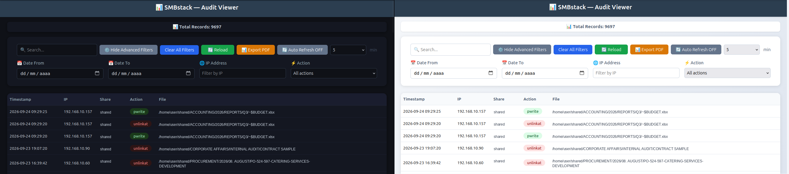
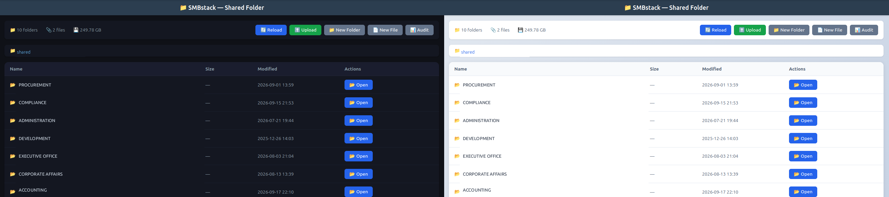
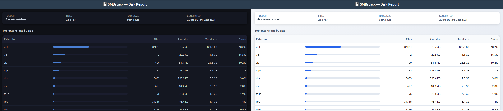

# [SMBstack](https://github.com/maravento) — Samba Server Stack

[](https://github.com/maravento/smbstack)
[](https://github.com/maravento/smbstack)
[](https://github.com/maravento/smbstack/stargazers)
[](https://twitter.com/maraventostudio)

<!-- markdownlint-disable MD033 -->

<table>
  <tr>
    <td style="width: 50%; vertical-align: top;">
      <p>Many small and medium-sized businesses, as well as other environments, require shared file storage on their local network. These installations may require recovery of deleted files, a record of file access, access through a web browser and control over the storage space in use. These functions are usually implemented with dedicated NAS hardware, whose cost can make this option unviable in certain environments.</p>
      <p>One alternative is to use <strong>Samba</strong> on Linux. However, a standard installation mainly provides file and folder sharing, while the remaining functions have to be implemented through additional components.</p>
      <p><strong>SMBstack</strong> provides part of this infrastructure using <strong>Samba</strong> on Ubuntu as its base.</p>
      <p>File sharing and permission management remain the responsibility of <strong>Samba</strong>. On that base, <strong>SMBstack</strong> provides functions such as a recycle bin with a separate channel per origin, audit logging through <code>rsyslog</code>, a web panel with three views and a daily disk usage report.</p>
      <p>Monitoring of service availability, folder size limits and configuration backups are handled by <code>smbload</code>, <code>smbwatch</code> and <code>smbbk</code>, which run in the background.</p>
    </td>
    <td style="width: 50%; vertical-align: top;">
      <p>Muchas pequeñas y medianas empresas, así como otros entornos, requieren almacenamiento de archivos compartido en su red local. Estas instalaciones pueden requerir recuperación de archivos eliminados, registro de acceso a los archivos, acceso mediante navegador web y control del espacio de almacenamiento utilizado. Estas funciones suelen implementarse mediante hardware NAS dedicado, cuyo costo puede hacer que esta opción no resulte viable en determinados entornos.</p>
      <p>Una alternativa es utilizar <strong>Samba</strong> sobre Linux. Sin embargo, una instalación estándar proporciona principalmente la compartición de archivos y carpetas, mientras que las demás funciones deben implementarse mediante componentes adicionales.</p>
      <p><strong>SMBstack</strong> proporciona parte de esta infraestructura utilizando <strong>Samba</strong> sobre Ubuntu como base.</p>
      <p>La compartición de archivos y la gestión de permisos continúan a cargo de <strong>Samba</strong>. Sobre esta base, <strong>SMBstack</strong> proporciona funciones como una papelera de reciclaje con un canal independiente por origen, registro de auditoría mediante <code>rsyslog</code>, un panel web con tres vistas y un informe diario de uso de disco.</p>
      <p>La supervisión de la disponibilidad de los servicios, los límites de tamaño por carpeta y los respaldos de configuración están a cargo de <code>smbload</code>, <code>smbwatch</code> y <code>smbbk</code>, que se ejecutan en segundo plano.</p>
    </td>
  </tr>
</table>

### Architecture

📐 [Runtime Architecture Diagram](https://htmlpreview.github.io/?https://raw.githubusercontent.com/maravento/smbstack/master/docs/smbstack-architecture.html) — visual walkthrough of the web/audit/recycle pipeline.

## REQUIREMENTS

---

**⚠️ WARNING:** Tested on Ubuntu 24.04/26.04 LTS. Use on other versions or distributions is at your own risk.

- Apache2 and PHP (`apache2`, `apache2-utils`, `libapache2-mod-php`, `php`)
- `rsyslog`, `logrotate`
- `acl`, `openssl`, `cron`, `iproute2`, `sudo`, `systemd`, `util-linux`, `zip` (checked by `smbsetup.sh`)
- `inotify-tools`, `procps`, `coreutils`, `findutils`, `cron`, `util-linux`, `sed`, `grep` (checked by `tools/smbwatch.sh`)
- `procps`, `samba`, `winbind`, `util-linux`, `coreutils`, `sed`, `systemd` (checked by `tools/smbload.sh`)
- `zip`, `coreutils`, `util-linux`, `cron` (checked by `tools/smbbk.sh`)

```bash
apt-get install -y apache2 apache2-utils libapache2-mod-php php rsyslog logrotate \
    acl openssl cron iproute2 sudo systemd util-linux sed grep inotify-tools \
    procps coreutils findutils zip
apt-get install -y --reinstall apache2-doc
```

The Samba packages (`samba`, `samba-common`, `samba-common-bin`, `smbclient`, `winbind`, `cifs-utils`) are installed by `smbsetup.sh` itself.

<table>
  <tr>
    <td style="width: 50%; vertical-align: top;">
      <strong>Important</strong>
      <ul>
        <li>The installer aborts if <code>nginx</code>, <code>lighttpd</code>, <code>caddy</code>, <code>ksmbd-tools</code> or <code>syslog-ng</code> are installed.</li>
        <li>The web panel listens on port <code>3092</code>, registered by <a href="https://www.iana.org/assignments/service-names-port-numbers/service-names-port-numbers.txt">IANA</a> as Unassigned.</li>
      </ul>
    </td>
    <td style="width: 50%; vertical-align: top;">
      <strong>Importante</strong>
      <ul>
        <li>El instalador aborta si <code>nginx</code>, <code>lighttpd</code>, <code>caddy</code>, <code>ksmbd-tools</code> o <code>syslog-ng</code> están instalados.</li>
        <li>El panel web escucha en el puerto <code>3092</code>, registrado por <a href="https://www.iana.org/assignments/service-names-port-numbers/service-names-port-numbers.txt">IANA</a> como Sin asignar.</li>
      </ul>
    </td>
  </tr>
</table>

## WEB INTERFACE

---

### Main Menu

[](https://github.com/maravento/smbstack)

<table>
  <tr>
    <td style="width: 50%; vertical-align: top;">
      <p>Each view can be opened in two ways:</p>
      <ul>
        <li><code>http://localhost:3092/?tab=shared</code>, <code>?tab=audit</code> or <code>?tab=report</code>: opens the panel on the corresponding tab and keeps the tab bar visible.</li>
        <li><code>http://localhost:3092/shared/</code>, <code>/audit/</code> or <code>/report/</code>: opens only the selected view, without the tab bar.</li>
      </ul>
      <p>Both forms of access are valid.</p>
    </td>
    <td style="width: 50%; vertical-align: top;">
      <p>Cada vista puede abrirse de dos maneras:</p>
      <ul>
        <li><code>http://localhost:3092/?tab=shared</code>, <code>?tab=audit</code> o <code>?tab=report</code>: abre el panel en la pestaña correspondiente y mantiene visible la barra de pestañas.</li>
        <li><code>http://localhost:3092/shared/</code>, <code>/audit/</code> o <code>/report/</code>: abre únicamente la vista seleccionada, sin la barra de pestañas.</li>
      </ul>
      <p>Ambas formas de acceso son válidas.</p>
    </td>
  </tr>
</table>

### SMBaudit

<table>
  <tr>
    <td style="width: 50%; vertical-align: top;">
      <p>The audit view is one of the three tabs of the web panel. It is accessed through <code>http://localhost:3092/?tab=audit</code>.</p>
      <p>The records come from <code>/var/log/samba/log.audit</code> and from its rotated copies. <code>smbapi.php</code> reads them and returns them in JSON format. The maximum number of records returned per request is defined by <code>MAX_LOG_LINES</code> in <code>smbstack.env</code>.</p>
      <p>Filtering by date range, IP, action and free text is performed in the browser, over the records already received. The results are shown in pages of 50, 100, 200 or 500 records.</p>
      <p>The <strong>Export PDF</strong> button opens a print window with three columns: timestamp, IP and file. The document is generated by the browser's print dialog, not by the server.</p>
    </td>
    <td style="width: 50%; vertical-align: top;">
      <p>La vista de auditoría es una de las tres pestañas del panel web. Se accede mediante <code>http://localhost:3092/?tab=audit</code>.</p>
      <p>Los registros provienen de <code>/var/log/samba/log.audit</code> y de sus copias rotadas. <code>smbapi.php</code> los lee y los devuelve en formato JSON. La cantidad máxima de registros devueltos por cada petición está definida por <code>MAX_LOG_LINES</code> en <code>smbstack.env</code>.</p>
      <p>El filtrado por rango de fechas, IP, acción y texto libre se realiza en el navegador, sobre los registros ya recibidos. Los resultados se muestran en páginas de 50, 100, 200 o 500 registros.</p>
      <p>El botón <strong>Export PDF</strong> abre una ventana de impresión con tres columnas: marca de tiempo, IP y archivo. El documento es generado por el diálogo de impresión del navegador, no por el servidor.</p>
    </td>
  </tr>
</table>

[](https://github.com/maravento/smbstack)

[](https://github.com/maravento/smbstack)

### SMBshared

<table>
  <tr>
    <td style="width: 50%; vertical-align: top;">
      <p>The web panel is an Apache VirtualHost listening on port <code>3092</code>. It is accessed through <code>http://localhost:3092/</code> and has three tabs: <strong>Shared</strong>, <strong>Audit</strong> and <strong>Report</strong>. Each tab corresponds to a separate page, which <code>index.php</code> loads inside a frame.</p>
      <p>The <strong>Shared</strong> tab displays the contents of the shared folder. From there a document can be opened, downloaded or moved to the recycle bin.</p>
      <p>The root level is read-only: it does not allow uploading files, creating folders or deleting items. These operations are available inside any subfolder.</p>
      <p>Apache runs the panel as the <code>www-data</code> user, which receives read and write permissions on the shared folder through an ACL set during the installation.</p>
      <p>The light and dark themes are selected from the top bar. The selection is stored in the browser and applied to the three tabs.</p>
    </td>
    <td style="width: 50%; vertical-align: top;">
      <p>El panel web es un VirtualHost de Apache que escucha en el puerto <code>3092</code>. Se accede mediante <code>http://localhost:3092/</code> y tiene tres pestañas: <strong>Shared</strong>, <strong>Audit</strong> y <strong>Report</strong>. Cada pestaña corresponde a una página independiente, que <code>index.php</code> carga dentro de un marco.</p>
      <p>La pestaña <strong>Shared</strong> muestra el contenido de la carpeta compartida. Desde allí se puede abrir un documento, descargarlo o moverlo a la papelera de reciclaje.</p>
      <p>El nivel raíz es de solo lectura: no permite subir archivos, crear carpetas ni eliminar elementos. Estas operaciones están disponibles dentro de cualquier subcarpeta.</p>
      <p>Apache ejecuta el panel como el usuario <code>www-data</code>, que recibe permisos de lectura y escritura sobre la carpeta compartida mediante una ACL establecida durante la instalación.</p>
      <p>Los temas claro y oscuro se seleccionan desde la barra superior. La selección se guarda en el navegador y se aplica a las tres pestañas.</p>
    </td>
  </tr>
</table>

[](https://github.com/maravento/smbstack)

<table>
  <tr>
    <td style="width: 50%; vertical-align: top;">
      <ul>
        <li>Inside a subfolder, the toolbar allows uploading one or more files, creating folders and reloading the view. Each operation is recorded in the audit log together with the client's IP address.</li>
        <li>Images and PDF files open in a modal through the <strong>Preview</strong> button, without being downloaded. For the remaining file types, the <strong>View</strong> button is kept, which opens the file in a new tab.</li>
        <li>Files can be uploaded through the file selector or by dropping them on the upload panel. A progress bar reports the state of the transfer.</li>
        <li>The panel can be installed as a Progressive Web App on Chrome, Edge and Safari, with offline access to the app shell. Firefox Desktop removed this capability in version 85, so in that browser the panel works as a normal web page, without showing the install option.</li>
      </ul>
    </td>
    <td style="width: 50%; vertical-align: top;">
      <ul>
        <li>Dentro de una subcarpeta, la barra de herramientas permite subir uno o varios archivos, crear carpetas y recargar la vista. Cada operación queda registrada en el registro de auditoría junto con la IP del cliente.</li>
        <li>Las imágenes y los archivos PDF se abren en un modal mediante el botón <strong>Preview</strong>, sin descargarlos. Para los demás tipos de archivo se mantiene el botón <strong>View</strong>, que abre el archivo en una pestaña nueva.</li>
        <li>Los archivos pueden subirse mediante el selector de archivos o soltándolos sobre el panel de subida. Una barra de progreso informa del estado de la transferencia.</li>
        <li>El panel puede instalarse como Progressive Web App en Chrome, Edge y Safari, con acceso sin conexión al shell de la aplicación. Firefox Desktop retiró esta capacidad en la versión 85, por lo que en ese navegador el panel funciona como una página web normal, sin mostrar la opción de instalación.</li>
      </ul>
    </td>
  </tr>
</table>

[](https://github.com/maravento/smbstack)

### SMBreport

<table>
  <tr>
    <td style="width: 50%; vertical-align: top;">
      <p>The report view is the third tab of the web panel. It is accessed through <code>http://localhost:3092/?tab=report</code>.</p>
      <p>It contains three tables: the thirty extensions with the largest total size, the thirty folders with the largest total size, and the fifty largest files, with their full path. The extensions table includes the file count, the average size and the share they represent of the total.</p>
      <p>The data is generated by <code>tools/smbreport.sh</code>, which walks the shared folder as <code>root</code> and writes the results in JSON format. A cron entry runs the script daily at 03:00. A full walk can take several minutes and competes for disk access with the SMB clients, so it is performed outside working hours.</p>
      <p>The view obtains the data through <code>smbapi.php</code> and does not walk the disk directly. Until the first walk completes, the tab reports that no report has been generated yet.</p>
    </td>
    <td style="width: 50%; vertical-align: top;">
      <p>La vista de informe es la tercera pestaña del panel web. Se accede mediante <code>http://localhost:3092/?tab=report</code>.</p>
      <p>Contiene tres tablas: las treinta extensiones con mayor tamaño total, las treinta carpetas con mayor tamaño total y los cincuenta archivos más grandes, con su ruta completa. La tabla de extensiones incluye el número de archivos, el tamaño promedio y la proporción que representan sobre el total.</p>
      <p>Los datos son generados por <code>tools/smbreport.sh</code>, que recorre la carpeta compartida como <code>root</code> y escribe los resultados en formato JSON. Una entrada de cron ejecuta el script diariamente a las 03:00. Un recorrido completo puede tardar varios minutos y compite por el acceso al disco con los clientes SMB, por lo que se realiza fuera del horario de trabajo.</p>
      <p>La vista obtiene los datos mediante <code>smbapi.php</code> y no recorre el disco directamente. Hasta que finalice el primer recorrido, la pestaña informa que todavía no se ha generado ningún informe.</p>
    </td>
  </tr>
</table>

[](https://github.com/maravento/smbstack)

## SCOPE

---

<table>
  <tr>
    <td style="width: 50%; vertical-align: top;">
      <b>What SMBstack does:</b>
      <ul>
        <li>Installs and configures Samba with a shared folder, recycle bin and group permissions.</li>
        <li>Configures audit logging through <code>rsyslog</code> to <code>/var/log/samba/log.audit</code>.</li>
        <li>Deploys a web panel with three tabs at <code>http://localhost:3092/</code>: shared folder, audit log and disk usage report.</li>
        <li>Configures <code>logrotate</code> for the Samba logs.</li>
        <li>Installs a service watchdog (<code>smbload.sh</code>), run through cron every 5 minutes.</li>
        <li>Installs a shared folder size monitor (<code>smbwatch.sh</code>), self-managed and independent of the installer.</li>
        <li>Provides a configuration backup tool (<code>smbbk.sh</code>), run through cron monthly.</li>
        <li>Installs a disk usage report (<code>smbreport.sh</code>), run through cron daily at 03:00.</li>
        <li>Saves the installation configuration to <code>/var/www/smbstack/smbstack.env</code> for future updates.</li>
        <li>Keeps NetBIOS disabled by default. It can be enabled manually if required; see the NetBIOS section.</li>
      </ul>
    </td>
    <td style="width: 50%; vertical-align: top;">
      <b>Lo que SMBstack hace:</b>
      <ul>
        <li>Instala y configura Samba con una carpeta compartida, papelera de reciclaje y permisos de grupo.</li>
        <li>Configura la auditoría mediante <code>rsyslog</code> en <code>/var/log/samba/log.audit</code>.</li>
        <li>Despliega un panel web con tres pestañas en <code>http://localhost:3092/</code>: carpeta compartida, registro de auditoría e informe de uso de disco.</li>
        <li>Configura <code>logrotate</code> para los registros de Samba.</li>
        <li>Instala un watchdog de servicios (<code>smbload.sh</code>) ejecutado mediante cron cada 5 minutos.</li>
        <li>Instala un monitor de espacio para la carpeta compartida (<code>smbwatch.sh</code>), autogestionado e independiente del instalador.</li>
        <li>Proporciona una herramienta de respaldo de configuración (<code>smbbk.sh</code>), ejecutada mediante cron mensualmente.</li>
        <li>Instala un informe de uso de disco (<code>smbreport.sh</code>), ejecutado mediante cron diariamente a las 03:00.</li>
        <li>Guarda la configuración de la instalación en <code>/var/www/smbstack/smbstack.env</code> para futuras actualizaciones.</li>
        <li>Mantiene NetBIOS deshabilitado por defecto. Puede activarse manualmente si es necesario; consulte la sección NetBIOS.</li>
      </ul>
    </td>
  </tr>
  <tr>
    <td style="width: 50%; vertical-align: top;">
      <b>Out of scope (not implemented):</b>
      <ul>
        <li>Active Directory / domain controller.</li>
        <li>Multiple shared folders.</li>
        <li>Custom paths outside <code>/home/$local_user/</code> (require manual editing).</li>
        <li>IPv6.</li>
        <li>LDAP.</li>
      </ul>
    </td>
    <td style="width: 50%; vertical-align: top;">
      <b>Fuera de alcance (no implementado):</b>
      <ul>
        <li>Active Directory / controlador de dominio.</li>
        <li>Múltiples carpetas compartidas.</li>
        <li>Rutas personalizadas fuera de <code>/home/$local_user/</code> (requieren edición manual).</li>
        <li>IPv6.</li>
        <li>LDAP.</li>
      </ul>
    </td>
  </tr>
</table>

## REPOSITORY STRUCTURE

---

```
smbstack/
├── acl/                         # Static access-control lists for Samba
│   └── commonveto.txt              # Veto list for common unwanted file types (active by default in smb.conf)
│
├── conf/                        # Samba and rsyslog configuration
│   ├── fullaudit.conf              # rsyslog full audit rule
│   └── smb.conf                    # Samba main config (placeholders: your_user, compartida)
│
├── tools/                      # Background watchdog and maintenance scripts
│   ├── smbbk.sh                    # Configuration backup for smbstack
│   ├── smbload.sh                  # Service watchdog (smbd + winbind + smbwatch)
│   ├── smbreport.sh                # Disk usage report for the shared folder (daily cron)
│   └── smbwatch.sh                 # Shared folder size monitor (self-managed)
│
├── web/                        # Web front-end: shared-folder browser, audit log viewer and disk report
│   ├── icon.svg                    # PWA / apple-touch icon
│   ├── index.php                   # Main page (Shared / Audit / Report tabs)
│   ├── manifest.json               # PWA manifest
│   ├── smbshared.php               # Shared folder dynamic browser
│   ├── smbapi.php                  # Audit log and disk report reader API
│   ├── smbaudit-diagnostic.php     # Audit log diagnostic tool
│   ├── smbaudit.html               # Audit log viewer UI
│   ├── smbreport.html              # Disk report viewer UI
│   ├── smbweb.conf                 # Apache vhost (:3092/?tab=shared, ?tab=audit and ?tab=report)
│   └── sw.js                       # PWA service worker (app-shell cache only)
│
└── smbsetup.sh                 # Installer: install, update, uninstall, status
```

<table>
  <tr>
    <td style="width: 50%; vertical-align: top;">
      Files and directories generated at runtime (not included in the repository):
    </td>
    <td style="width: 50%; vertical-align: top;">
      Archivos y directorios generados en runtime (no incluidos en el repositorio):
    </td>
  </tr>
</table>

```
/var/www/smbstack/
├── .size_cache/                # Folder size cache used by smbshared.php (www-data, pruned daily by cron)
├── tools/                      # Deployed copy of tools/*.sh
├── web/                        # Deployed copy of web/ (served by Apache on :3092)
│   └── smbreport.json          # Disk report written by tools/smbreport.sh (root:www-data, 640)
└── smbstack.env                # Saved install config (user, paths, network, trusted proxies, watch limit, max log lines)

/etc/bak/smbstack/              # Archives written by tools/smbbk.sh (smbbk_<YYYYMMDD_HHMM>.zip, last 3 kept),
                                # run by --update before overwriting application code, and by its own monthly cron
/etc/cron.d/smbstack            # All cron entries of the project, one file

/var/log/smbwatch.log           # smbwatch.sh runtime log (root:root, 640)
/var/log/smbload.log            # smbload.sh runtime log

/home/$local_user/shared/       # Shared folder (independent of the installer)
├── .recycle/                   # Recycle Bin (smbguest/, www-data/, smbwatch/)
└── DEMO/                       # Demo folder

/etc/logrotate.d/samba          # Generated by installer (heredoc)
/etc/logrotate.d/smbwatch       # Generated by installer (heredoc), rotates /var/log/smbwatch.log
/var/log/samba/log.audit        # Created by rsyslog
/var/log/samba/log.samba        # Created by installer, written directly by smbd

/etc/samba/acl/commonveto.txt   # Copied from acl/commonveto.txt by the installer
```

> Every cron entry of the project lives in `/etc/cron.d/smbstack`. `smbsetup.sh`, `tools/smbwatch.sh`, `tools/smbreport.sh` and `tools/smbbk.sh` add or remove their own line in that file.
>
> Each line carries the user that runs the task, which is a field of the `/etc/cron.d` format. Adding or removing an entry touches that file only, so the cron jobs of other projects are never at risk.
>
> `--uninstall` deletes the file.
>
> Installations made before this change keep their entries in root's crontab. The installer removes them, identified by the full script path.
>
> Todas las entradas de cron del proyecto viven en `/etc/cron.d/smbstack`. `smbsetup.sh`, `tools/smbwatch.sh`, `tools/smbreport.sh` y `tools/smbbk.sh` agregan o eliminan su propia línea en ese archivo.
>
> Cada línea lleva el usuario que ejecuta la tarea, que es un campo del formato `/etc/cron.d`. Agregar o eliminar una entrada toca únicamente ese archivo, así que las tareas de otros proyectos nunca corren riesgo.
>
> `--uninstall` elimina el archivo.
>
> Las instalaciones anteriores a este cambio conservan sus entradas en el crontab de root. El instalador las retira, identificadas por la ruta completa del script.

## HOW TO USE

---

### Install

<table>
  <tr>
    <td style="width: 50%; vertical-align: top;">
      Download the repository and run the installer:
    </td>
    <td style="width: 50%; vertical-align: top;">
      Descarga el repositorio y ejecuta el instalador:
    </td>
  </tr>
</table>

```bash
git clone --depth=1 https://github.com/maravento/smbstack.git
cd smbstack
sudo bash smbsetup.sh
# or, to skip the menu and install directly | o, para saltar el menú e instalar directamente
sudo bash smbsetup.sh --install
```

<table>
  <tr>
    <td style="width: 50%; vertical-align: top;">
      The installer will prompt for:
    </td>
    <td style="width: 50%; vertical-align: top;">
      El instalador preguntará por:
    </td>
  </tr>
</table>

| Prompt | Description | Descripción |
|--------|-------------|-------------|
| Shared folder name | Name for the shared folder (created under `/home/$local_user/`) | Nombre de la carpeta compartida (creada bajo `/home/$local_user/`) |
| Network interface | Selected from available interfaces listed. The Samba network is derived from its address and prefix | Seleccionada de las interfaces disponibles listadas. La red de Samba se deriva de su dirección y prefijo |
| Samba username | Samba account to create | Cuenta de Samba a crear |
| Overwrite smb.conf | Only asked if `/etc/samba/smb.conf` already exists | Solo se pregunta si `/etc/samba/smb.conf` ya existe |

<table>
  <tr>
    <td style="width: 50%; vertical-align: top;">
      <p>Set <code>SMBSTACK_IFACE</code> to skip the interactive interface selection. For example:</p>
      <p><code>SMBSTACK_IFACE=eth1 sudo bash smbsetup.sh --install</code></p>
      <p>Another installer deploying SMBstack can use this variable to provide the interface it already knows.</p>
      <p><code>$local_user</code> is the local Linux user that the installer detects automatically.</p>
      <p>To determine it, the installer looks at the users with a UID within the range defined by <code>UID_MIN</code> and <code>UID_MAX</code> in <code>/etc/login.defs</code>, excluding those whose shell is <code>/false</code> or <code>/nologin</code>. Among the users belonging to the <code>sudo</code> group, it selects the one with the lowest UID.</p>
      <p>That user is set as the owner of the shared folder and as the base name of the Samba account.</p>
    </td>
    <td style="width: 50%; vertical-align: top;">
      <p>Define <code>SMBSTACK_IFACE</code> para omitir la selección interactiva de la interfaz. Por ejemplo:</p>
      <p><code>SMBSTACK_IFACE=eth1 sudo bash smbsetup.sh --install</code></p>
      <p>Otro instalador que despliega SMBstack puede utilizar esta variable para proporcionar la interfaz que ya conoce.</p>
      <p><code>$local_user</code> es el usuario local de Linux que el instalador detecta automáticamente.</p>
      <p>Para determinarlo, el instalador revisa los usuarios con UID dentro del rango definido por <code>UID_MIN</code> y <code>UID_MAX</code> en <code>/etc/login.defs</code>, excluyendo aquellos cuya shell es <code>/false</code> o <code>/nologin</code>. Entre los usuarios pertenecientes al grupo <code>sudo</code>, selecciona el de UID más bajo.</p>
      <p>Ese usuario se establece como propietario de la carpeta compartida y como nombre base de la cuenta de Samba.</p>
    </td>
  </tr>
</table>

### Update & Uninstall

<table>
  <tr>
    <td style="width: 50%; vertical-align: top;">
      To update or uninstall SMBstack, download the updated repository, enter the folder and run:
    </td>
    <td style="width: 50%; vertical-align: top;">
      Para actualizar o desinstalar SMBstack, descarga el repositorio actualizado, entra a la carpeta y ejecuta:
    </td>
  </tr>
</table>

```bash
cd smbstack
sudo bash smbsetup.sh --update
# or | o
sudo bash smbsetup.sh --uninstall
```

| File | `--update` | `--uninstall` |
|------|-----------|---------------|
| `conf/smb.conf` | ⛔ not touched (user-customized) | ✅ restored from `.bak` if it exists (only created when the installer overwrote a pre-existing `smb.conf`; on a fresh install, no `.bak` exists and `smb.conf` is left untouched) |
| `conf/fullaudit.conf` | ⛔ not touched (user-customized) | ✅ removed |
| `web/smbweb.conf` | ⛔ not touched (user-customized) | ✅ removed |
| `web/index.php` | ✅ overwritten | ✅ removed |
| `web/smbaudit.html` | ✅ overwritten | ✅ removed |
| `web/smbapi.php` | ✅ overwritten | ✅ removed |
| `web/smbaudit-diagnostic.php` | ✅ overwritten | ✅ removed |
| `web/smbshared.php` | ✅ overwritten | ✅ removed |
| `web/manifest.json` | ✅ overwritten | ✅ removed |
| `web/sw.js` | ✅ overwritten | ✅ removed |
| `web/icon.svg` | ✅ overwritten | ✅ removed |
| `tools/smbbk.sh` | ✅ overwritten | ✅ removed (its cron entry is deregistered first) |
| `tools/smbload.sh` | ✅ overwritten | ✅ removed |
| `tools/smbwatch.sh` | ✅ overwritten | ✅ removed |
| `/var/www/smbstack/smbstack.env` | ⛔ preserved | ✅ removed |
| Shared folder (`/home/$local_user/shared/`) | ⛔ never touched | ⛔ never touched |

> The shared folder is independent of the installer. To remove it, do so manually: `rm -rf /home/$local_user/shared`
>
> La carpeta compartida es independiente del instalador. Para eliminarla, hazlo manualmente: `rm -rf /home/$local_user/shared`

<table>
  <tr>
    <td style="width: 50%; vertical-align: top;">
      <p><code>--update</code> calls <code>tools/smbbk.sh</code> before overwriting anything, which writes a full backup to <code>/etc/bak/smbstack</code>.</p>
      <p>It only updates the application code: the web viewers in PHP and HTML and <code>tools/*.sh</code>.</p>
      <p>The configuration files deployed during the installation, <code>smb.conf</code>, <code>fullaudit.conf</code> and <code>smbweb.conf</code>, are never overwritten, since they may contain manual edits such as custom shares, <code>hosts allow</code> or interfaces.</p>
      <p>To incorporate changes to those files after an update, compare them manually against <code>conf/</code> and <code>web/smbweb.conf</code> in the repository and apply the changes yourself.</p>
    </td>
    <td style="width: 50%; vertical-align: top;">
      <p><code>--update</code> llama a <code>tools/smbbk.sh</code> antes de sobrescribir nada, que escribe una copia completa en <code>/etc/bak/smbstack</code>.</p>
      <p>Solo actualiza el código de la aplicación: los visores web en PHP y HTML y <code>tools/*.sh</code>.</p>
      <p>Los archivos de configuración desplegados en la instalación, <code>smb.conf</code>, <code>fullaudit.conf</code> y <code>smbweb.conf</code>, nunca se sobrescriben, ya que pueden contener ediciones manuales como shares personalizados, <code>hosts allow</code> o interfaces.</p>
      <p>Para incorporar cambios de esos archivos tras una actualización, compárelos a mano contra <code>conf/</code> y <code>web/smbweb.conf</code> en el repositorio y aplique los cambios usted mismo.</p>
    </td>
  </tr>
</table>

### Status

```bash
sudo bash smbsetup.sh --status
```

<table>
  <tr>
    <td style="width: 50%; vertical-align: top;">
      <p>Shows the status of the <code>smbd</code> and <code>winbind</code> services, the status of Apache port <code>3092</code>, the last five audit log entries and a <code>testparm</code> summary.</p>
    </td>
    <td style="width: 50%; vertical-align: top;">
      <p>Muestra el estado de los servicios <code>smbd</code> y <code>winbind</code>, el estado del puerto <code>3092</code> de Apache, las últimas cinco entradas del registro de auditoría y un resumen de <code>testparm</code>.</p>
    </td>
  </tr>
</table>

### Config

<table>
  <tr>
    <td style="width: 50%; vertical-align: top;">
      After installation, the main configuration files are:
    </td>
    <td style="width: 50%; vertical-align: top;">
      Tras la instalación, los archivos de configuración principales son:
    </td>
  </tr>
</table>

| Description | File |
|-------------|------|
| Samba main config | `/etc/samba/smb.conf` |
| Audit rsyslog rule | `/etc/rsyslog.d/fullaudit.conf` |
| Web vhost (audit + shared) | `/etc/apache2/sites-available/smbweb.conf` |
| Log rotation (Samba logs) | `/etc/logrotate.d/samba` |
| Log rotation (`smbwatch.sh`) | `/etc/logrotate.d/smbwatch` |
| Install config | `/var/www/smbstack/smbstack.env` |

<table>
  <tr>
    <td style="width: 50%; vertical-align: top;">
      <p><code>smbstack.env</code> sets <code>TRUSTED_PROXIES="127.0.0.1"</code> by default.</p>
      <p>This setting tells <code>web/smbshared.php</code> that, for requests arriving from <code>localhost</code>, it must use the <code>CF-Connecting-IP</code> or <code>X-Forwarded-For</code> header, when present, instead of <code>REMOTE_ADDR</code>. This way the loopback connection of a local tunnel is not recorded as the client address in the audit log.</p>
      <p>The setting has no effect on direct access from the LAN.</p>
    </td>
    <td style="width: 50%; vertical-align: top;">
      <p><code>smbstack.env</code> establece <code>TRUSTED_PROXIES="127.0.0.1"</code> por defecto.</p>
      <p>Esta configuración indica a <code>web/smbshared.php</code> que, para las solicitudes que llegan desde <code>localhost</code>, utilice el encabezado <code>CF-Connecting-IP</code> o <code>X-Forwarded-For</code>, cuando esté presente, en lugar de <code>REMOTE_ADDR</code>. De esta forma, la conexión loopback de un túnel local no se registra como la dirección del cliente en el registro de auditoría.</p>
      <p>La configuración no tiene efecto sobre el acceso directo desde la LAN.</p>
    </td>
  </tr>
</table>

```bash
# Verify Samba config | Verificar configuración de Samba
testparm

# Restart services | Reiniciar servicios
sudo systemctl restart smbd winbind

# View audit log | Ver log de auditoría
tail -f /var/log/samba/log.audit

# List Samba users | Listar usuarios de Samba
sudo pdbedit -L
```

<table>
  <tr>
    <td style="width: 50%; vertical-align: top;">
      <p>To use a shared folder located outside <code>/home/$local_user/</code>, edit <code>/etc/samba/smb.conf</code> and <code>/etc/apache2/sites-available/smbweb.conf</code> manually after the installation.</p>
    </td>
    <td style="width: 50%; vertical-align: top;">
      <p>Para utilizar una carpeta compartida ubicada fuera de <code>/home/$local_user/</code>, edita manualmente <code>/etc/samba/smb.conf</code> y <code>/etc/apache2/sites-available/smbweb.conf</code> después de la instalación.</p>
    </td>
  </tr>
</table>

### Recycle Bin

<table>
  <tr>
    <td style="width: 50%; vertical-align: top;">
      <p>SMBstack uses the Samba <code>vfs_recycle</code> module to redirect deleted files to a hidden recycle bin, instead of removing them permanently. The bin is stored inside the shared folder, under <code>.recycle/</code>.</p>
    </td>
    <td style="width: 50%; vertical-align: top;">
      <p>SMBstack utiliza el módulo <code>vfs_recycle</code> de Samba para redirigir los archivos eliminados a una papelera de reciclaje oculta, en lugar de borrarlos permanentemente. Esta se almacena dentro de la carpeta compartida, en <code>.recycle/</code>.</p>
    </td>
  </tr>
</table>

#### Recycle bin channels

<table>
  <tr>
    <td style="width: 50%; vertical-align: top;">
      <p>SMBstack uses three independent channels to write to the recycle bin, each running under a different system context:</p>
    </td>
    <td style="width: 50%; vertical-align: top;">
      <p>SMBstack utiliza tres canales independientes para escribir en la papelera de reciclaje, cada uno ejecutándose bajo un contexto de sistema diferente:</p>
    </td>
  </tr>
</table>

| Path | Written by | Purpose | Propósito |
|---|---|---|---|
| `.recycle/smbguest/` | SMB clients on the LAN, through `vfs_recycle` (`smbguest`, set by `force user` in `smb.conf`) | Holds files deleted by users from Windows or Linux over the network | Guarda los archivos borrados por los usuarios desde Windows o Linux por la red |
| `.recycle/www-data/` | The web interface running under Apache (`www-data`) | Holds files deleted from the browser panel | Guarda los archivos borrados desde el panel web |
| `.recycle/smbwatch/` | `tools/smbwatch.sh` (`${LOCAL_USER:-root}:sambashare`) | Holds files moved out automatically when a monitored folder exceeds its size limit | Guarda los archivos retirados automáticamente cuando una carpeta monitoreada supera su límite de tamaño |

<table>
  <tr>
    <td style="width: 50%; vertical-align: top;">
      This is why the recycle bin directory contains one subdirectory per channel:
    </td>
    <td style="width: 50%; vertical-align: top;">
      Por eso el directorio de la papelera contiene un subdirectorio por canal:
    </td>
  </tr>
</table>

```
.recycle/
├── smbguest/               # Files deleted by Windows/Linux SMB clients on the LAN
│   └── DOCUMENTS/
│       ├── report.docx
│       └── Copy #1 of report.docx
├── www-data/               # Files deleted via the web browser interface
│   └── 20260623/
│       └── invoice.pdf
└── smbwatch/               # Files auto-moved by the size-limit watchdog
    └── 20260711/
        └── bigfile.iso
```

> **Note:** the recycle bin lives inside the shared folder itself, so that recycling a file is a `mv` within the same filesystem: instantaneous and without copying data, something that would not happen if the bin were on another disk. For the details of each channel, see the *Web Interface*, *smbwatch* and *Configuration reference* sections.

> **Nota:** la papelera vive dentro de la propia carpeta compartida para que reciclar un archivo sea un `mv` dentro del mismo sistema de archivos: instantáneo y sin copiar datos, algo que no ocurriría si la papelera estuviera en otro disco. Para conocer el detalle de cada canal, consulta las secciones *Web Interface*, *smbwatch* y *Configuration reference*.

#### Recycle timestamp

<table>
  <tr>
    <td style="width: 50%; vertical-align: top;">
      <p>The weekly cleanup determines which items to delete from their modification date. That date must therefore correspond to the moment the item was recycled, and not to the last modification of the document. Otherwise, an old file recycled today could be considered expired and removed on the next run.</p>
      <p>Each channel updates the item's modification date with the current date when moving it to the bin:</p>
    </td>
    <td style="width: 50%; vertical-align: top;">
      <p>La limpieza semanal determina qué elementos borrar a partir de su fecha de modificación. Por ello, esta fecha debe corresponder al momento en que el elemento fue reciclado y no a la última modificación del documento. De lo contrario, un archivo antiguo reciclado hoy podría considerarse vencido y eliminarse en la siguiente pasada.</p>
      <p>Cada canal actualiza la fecha de modificación del elemento con la fecha actual al moverlo a la papelera:</p>
    </td>
  </tr>
</table>

| Channel | Stamped by |
|---------|------------|
| SMB (LAN clients) | `recycle:touch = yes` in `smb.conf` |
| Web interface (Apache) | `recycle_touch()` in `web/smbshared.php`, applied recursively so a recycled folder carries its contents |
| Size-limit watchdog | `touch` after the move, in `tools/smbwatch.sh` |

> A restored item therefore carries the date it was recycled, not its original one.
>
> Por eso un elemento restaurado conserva la fecha en que fue reciclado, no la original.

#### File versioning

<table>
  <tr>
    <td style="width: 50%; vertical-align: top;">
      <p>When <code>recycle:versions = yes</code> is active, deleting a file that already exists in the recycle bin does not overwrite it. The new copy is kept alongside the original with the <code>Copy #N of</code> prefix:</p>
    </td>
    <td style="width: 50%; vertical-align: top;">
      <p>Cuando <code>recycle:versions = yes</code> está activo, eliminar un archivo que ya existe en la papelera no lo sobrescribe. La nueva copia se conserva junto a la original con el prefijo <code>Copy #N of</code>:</p>
    </td>
  </tr>
</table>

```
.recycle/smbguest/DOCUMENTS/
├── report.docx             ← first deletion
└── Copy #1 of report.docx  ← second deletion of the same file
```

<table>
  <tr>
    <td style="width: 50%; vertical-align: top;">
      To exclude specific file types from versioning, use <code>recycle:noversions</code>. These types are still recycled, but repeated deletions <strong>overwrite</strong> the previous copy in the bin rather than creating a numbered duplicate:
    </td>
    <td style="width: 50%; vertical-align: top;">
      Para excluir tipos de archivo del versionado, usa <code>recycle:noversions</code>. Estos archivos siguen yendo a la papelera, pero eliminaciones repetidas <strong>sobreescriben</strong> la copia anterior en lugar de crear una nueva numerada:
    </td>
  </tr>
</table>

```ini
# All files keep multiple versions:
recycle:versions = yes

# These types are recycled but NOT versioned — second delete overwrites the first:
recycle:noversions = *.dat,*.ini
```

<table>
  <tr>
    <td style="width: 50%; vertical-align: top;">
      Use <code>noversions</code> for files where accumulating copies adds no value: runtime data files, config dumps, ini snapshots, and similar.
    </td>
    <td style="width: 50%; vertical-align: top;">
      Usa <code>noversions</code> para archivos donde acumular copias no aporta valor: archivos de datos en tiempo de ejecución, volcados de configuración, snapshots de ini y similares.
    </td>
  </tr>
</table>

#### Configuration reference

| Parameter | Value | Purpose | Propósito |
|-----------|-------|---------|-----------|
| `recycle:repository` | `.recycle/%U` | SMB channel recycle bin, resolves to `smbguest` | Papelera del canal SMB, resuelve a `smbguest` |
| `recycle:directory_mode` | `0775` | Group-writable recycle directory | Directorio escribible por el grupo |
| `recycle:keeptree` | `yes` | Preserve original folder structure | Preservar estructura de carpetas |
| `recycle:versions` | `yes` | Keep multiple versions of deleted files | Mantener múltiples versiones |
| `recycle:noversions` | `*.dat,*.ini` | Exclude patterns from versioning | Excluir patrones del versionado |
| `recycle:touch` | `yes` | Update access time when recycled | Actualizar tiempo de acceso al reciclar |
| `recycle:exclude` | `*.tmp,*.temp,*.o,…` | Permanently delete matching files | Eliminar permanentemente archivos que coincidan |
| `recycle:exclude_dir` | `/temp,/tmp,/cache,/.Trash-1000` | Bypass recycle bin for directories | Omitir papelera para directorios |
| `recycle:maxsize` | `1073741824` | Max file size (1 GB) | Tamaño máximo (1 GB) |
| `hide files` | `/.recycle/` | Hide recycle directory from clients | Ocultar papelera a los clientes |

#### Automatic cleanup

<table>
  <tr>
    <td style="width: 50%; vertical-align: top;">
      <p>The installer registers a weekly cron job, run as <code>root</code>, that removes recycled files older than 7 days:</p>
    </td>
    <td style="width: 50%; vertical-align: top;">
      <p>El instalador registra una tarea cron semanal, ejecutada como <code>root</code>, que elimina los archivos reciclados con más de 7 días de antigüedad:</p>
    </td>
  </tr>
</table>

```bash
@weekly find "/home/$local_user/shared/.recycle/" -depth -mindepth 1 -mtime +6 -delete >/dev/null 2>&1
```

> The job runs once a week, so an item stays in the bin between 7 and 13 days depending on the day it was recycled.
>
> La tarea corre una vez por semana, así que un elemento permanece en la papelera entre 7 y 13 días según el día en que se recicló.

<table>
  <tr>
    <td style="width: 50%; vertical-align: top;">
      To adjust the retention period or inspect the entry:
    </td>
    <td style="width: 50%; vertical-align: top;">
      Para ajustar el período de retención o inspeccionar la entrada:
    </td>
  </tr>
</table>

```bash
sudo crontab -e
```

---

### Full Audit

<table>
  <tr>
    <td style="width: 50%; vertical-align: top;">
      <p>SMBstack uses the Samba <code>vfs_full_audit</code> module to record file operations in <code>/var/log/samba/log.audit</code> through <code>rsyslog</code>. Only successful operations are recorded; failures are excluded to keep the log clean.</p>
    </td>
    <td style="width: 50%; vertical-align: top;">
      <p>SMBstack utiliza el módulo <code>vfs_full_audit</code> de Samba para registrar las operaciones de archivos en <code>/var/log/samba/log.audit</code> mediante <code>rsyslog</code>. Solo se registran las operaciones exitosas; los fallos se excluyen para mantener el registro limpio.</p>
    </td>
  </tr>
</table>

#### Configuration reference

| Parameter | Value | Description | Descripción |
|-----------|-------|-------------|-------------|
| `full_audit:logfile` | `/var/log/samba/log.audit` | Destination log file, written via the rsyslog rule in `/etc/rsyslog.d/fullaudit.conf`. | Archivo de log de destino, escrito mediante la regla rsyslog en `/etc/rsyslog.d/fullaudit.conf`. |
| `full_audit:prefix` | `%I\|%m\|%S` | Fields prepended to each log entry: `%I` = client IP address, `%m` = client machine name, `%S` = share name. | Campos que se anteponen a cada entrada del log: `%I` = IP del cliente, `%m` = nombre del equipo cliente, `%S` = nombre del share. |
| `full_audit:success` | `mkdirat renameat unlinkat pwrite` | VFS operations logged when they succeed. See table below. | Operaciones VFS que se registran cuando tienen éxito. Ver tabla a continuación. |
| `full_audit:failure` | `none` | No failed operations are logged. | No se registran operaciones fallidas. |
| `full_audit:facility` | `LOCAL5` | rsyslog facility used to route audit entries to the dedicated log file, keeping them separate from general system logs. | Facility de rsyslog usada para enrutar las entradas de auditoría al archivo dedicado, manteniéndolas separadas de los logs generales del sistema. |
| `full_audit:priority` | `notice` | Syslog priority level assigned to audit entries. | Nivel de prioridad syslog asignado a las entradas de auditoría. |

#### Logged operations

| Samba syscall | Triggered by | Desencadenado por |
|---------------|--------------|-------------------|
| `mkdirat` | Creating a directory via SMB or the web interface | Creación de un directorio vía SMB o la interfaz web |
| `renameat` | Renaming or moving a file or folder. Also triggered by Windows clients when saving a file (temp file + rename pattern). | Renombrado o movimiento de archivo o carpeta. También lo disparan los clientes Windows al guardar un archivo (patrón de archivo temporal + renombrado). |
| `unlinkat` | File deletion — permanent or moved to the recycle bin. See caveat below. | Borrado de archivo — permanente o movido a la papelera. Ver matiz abajo. |
| `pwrite` | Data written to an open file, via SMB or via the web interface. See caveat below. | Datos escritos en un archivo abierto, vía SMB o vía la interfaz web. Ver matiz abajo. |

##### Caveats

<table>
  <tr>
    <td style="width: 50%; vertical-align: top;">
      <ul>
        <li><b><code>renameat</code> format:</b> recorded as <code>source_path|destination_path</code>. This operation does not appear for recycle bin operations.</li>
        <li><b>Recycled vs. permanently deleted:</b> <code>unlinkat</code> does not allow telling both operations apart, since <code>vfs_full_audit</code> intercepts the call before <code>vfs_recycle</code> redirects it. To determine what happened, check the <code>.recycle/</code> directory on the filesystem.</li>
        <li><b><code>pwrite</code> source:</b> it can be recorded both by Samba (SMB clients) and by <code>smbshared.php</code> (uploads from the web interface, which do not go through <code>smbd</code>). To tell them apart, check the syslog <code>$user</code> field before <code>smbd_audit:</code>; the web interface always records it as <code>www-data</code>.</li>
      </ul>
    </td>
    <td style="width: 50%; vertical-align: top;">
      <ul>
        <li><b>Formato de <code>renameat</code>:</b> se registra como <code>ruta_origen|ruta_destino</code>. Esta operación no aparece en las operaciones de la papelera de reciclaje.</li>
        <li><b>Reciclado vs. eliminación permanente:</b> <code>unlinkat</code> no permite distinguir entre ambas operaciones, ya que <code>vfs_full_audit</code> intercepta la llamada antes de que <code>vfs_recycle</code> la redirija. Para determinar qué ocurrió, comprueba el directorio <code>.recycle/</code> en el sistema de archivos.</li>
        <li><b>Origen de <code>pwrite</code>:</b> puede ser registrado tanto por Samba (clientes SMB) como por <code>smbshared.php</code> (subidas desde la interfaz web, que no pasan por <code>smbd</code>). Para distinguirlos, revisa el campo <code>$user</code> de syslog antes de <code>smbd_audit:</code>; la interfaz web siempre lo registra como <code>www-data</code>.</li>
      </ul>
    </td>
  </tr>
</table>

##### Why `openat` is not audited

<table>
  <tr>
    <td style="width: 50%; vertical-align: top;">
      <p><code>openat</code> was evaluated and excluded from <code>full_audit:success</code> by default.</p>
      <p>Every file or directory open generates an entry, including browsing, reads and downloads, not only writes. A single Explorer window open on a busy folder can produce dozens of near-identical lines per second.</p>
      <p>This volume of records can hide the events actually worth reviewing, and adds no further traceability, since <code>pwrite</code> records the write itself.</p>
      <p>This is a project configuration decision, not a Samba limitation. To audit opens and reads as well, add it manually in <code>/etc/samba/smb.conf</code>:</p>
      <p><code>full_audit:success = mkdirat renameat unlinkat pwrite openat</code></p>
      <p>Then run <code>testparm</code> and <code>systemctl restart smbd</code>. <code>--update</code> will not modify this setting: <code>smb.conf</code> is not overwritten after the installation, so the change is preserved.</p>
    </td>
    <td style="width: 50%; vertical-align: top;">
      <p>Se evaluó y se decidió excluir <code>openat</code> de <code>full_audit:success</code> por defecto.</p>
      <p>Cada apertura de archivo o carpeta genera una entrada, incluida la navegación, las lecturas y las descargas, no solo las escrituras. Una sola ventana del Explorador abierta sobre una carpeta con actividad puede producir decenas de líneas casi idénticas por segundo.</p>
      <p>Este volumen de registros puede ocultar los eventos que sí conviene revisar y no aporta trazabilidad adicional, ya que <code>pwrite</code> registra la escritura propiamente dicha.</p>
      <p>Esta es una decisión de configuración del proyecto, no una limitación de Samba. Para auditar también las aperturas y lecturas, agréguelo manualmente en <code>/etc/samba/smb.conf</code>:</p>
      <p><code>full_audit:success = mkdirat renameat unlinkat pwrite openat</code></p>
      <p>Luego, ejecute <code>testparm</code> y <code>systemctl restart smbd</code>. <code>--update</code> no modificará este ajuste: <code>smb.conf</code> no se sobrescribe después de la instalación, por lo que el cambio se conserva.</p>
    </td>
  </tr>
</table>

---

### smbload

<table>
  <tr>
    <td style="width: 50%; vertical-align: top;">
      <p><code>smbload.sh</code> is a service watchdog that checks that <code>smbd</code> and <code>winbind</code> are running. Neither unit has a <code>Restart=</code> policy configured, so they are not restarted automatically when they stop.</p>
      <p>It also checks that <code>smbwatch.sh</code> is still running and restarts it if it has stopped.</p>
      <p>The installer registers <code>smbload.sh</code> in cron automatically, to run every 5 minutes. The script is located in <code>/var/www/smbstack/tools/</code>.</p>
    </td>
    <td style="width: 50%; vertical-align: top;">
      <p><code>smbload.sh</code> es un watchdog de servicios que comprueba que <code>smbd</code> y <code>winbind</code> estén en ejecución. Ninguna de las dos unidades tiene configurada una política <code>Restart=</code>, por lo que no se reinician automáticamente cuando se detienen.</p>
      <p>También comprueba que <code>smbwatch.sh</code> siga ejecutándose y lo reinicia si ha dejado de hacerlo.</p>
      <p>El instalador registra automáticamente <code>smbload.sh</code> en cron para ejecutarlo cada 5 minutos. El script se encuentra en <code>/var/www/smbstack/tools/</code>.</p>
    </td>
  </tr>
</table>

```bash
# sudo crontab -l
*/5 * * * * /var/www/smbstack/tools/smbload.sh
```

> **Note:** the smbwatch check is inert until `WATCH_LIMIT_GB` and `WATCH_EXCLUDE` exist and are valid in `smbstack.env`, which happens the first time `smbwatch.sh start` is run from a terminal and its questions are answered. Until then `smbload.sh` logs a `-- skip` line and does not launch it.

> **Nota:** la vigilancia de smbwatch permanece inactiva hasta que `WATCH_LIMIT_GB` y `WATCH_EXCLUDE` existan y sean válidas en `smbstack.env`, lo que ocurre la primera vez que se ejecuta `smbwatch.sh start` desde un terminal y se responden sus preguntas. Hasta entonces `smbload.sh` registra una línea `-- skip` y no lo lanza.

### smbwatch

<table>
  <tr>
    <td style="width: 50%; vertical-align: top;">
      <p><code>smbwatch.sh</code> monitors the first-level subfolders of the shared folder in real time, using <code>inotifywait</code>.</p>
      <p>When a subfolder exceeds the configured size limit, the file that triggers the event is moved to <code>.recycle/smbwatch/&lt;YYYYMMDD&gt;/</code>. This is its own recycle channel, independent of <code>.recycle/smbguest/</code> and <code>.recycle/www-data/</code>. See the <i>Recycle bin channels</i> section.</p>
      <p><code>smbwatch.sh</code> is managed independently of the installer. It reads its configuration from <code>smbstack.env</code> and asks for any missing value, which requires an interactive terminal. If a value is missing and no terminal is available, for example when run through cron, the script aborts instead of waiting for an answer.</p>
    </td>
    <td style="width: 50%; vertical-align: top;">
      <p><code>smbwatch.sh</code> monitorea en tiempo real las subcarpetas de primer nivel de la carpeta compartida mediante <code>inotifywait</code>.</p>
      <p>Cuando una subcarpeta supera el límite de tamaño configurado, el archivo que genera el evento se mueve a <code>.recycle/smbwatch/&lt;AAAAMMDD&gt;/</code>. Este es su propio canal de reciclaje, independiente de <code>.recycle/smbguest/</code> y <code>.recycle/www-data/</code>. Consulta la sección <i>Recycle bin channels</i>.</p>
      <p><code>smbwatch.sh</code> se administra de forma independiente del instalador. Lee su configuración de <code>smbstack.env</code> y solicita cualquier valor que falte, lo que requiere una terminal interactiva. Si falta un valor y no hay una terminal disponible, por ejemplo cuando se ejecuta mediante cron, el script aborta en lugar de quedar esperando una respuesta.</p>
    </td>
  </tr>
</table>

| `smbstack.env` variable | Default | Purpose | Propósito |
|---|---|---|---|
| `WATCH_LIMIT_GB` | `10` | Size limit per monitored folder, in GB | Límite de tamaño por carpeta monitoreada, en GB |
| `WATCH_EXCLUDE` | `NONE` | Comma-separated folder names excluded from monitoring (e.g. `FINANCE,LEGAL`) | Nombres de carpetas separados por comas excluidas del monitoreo |

```bash
# Start
sudo /var/www/smbstack/tools/smbwatch.sh start

# Stop
sudo /var/www/smbstack/tools/smbwatch.sh stop

# Status
sudo /var/www/smbstack/tools/smbwatch.sh status
```

<table>
  <tr>
    <td style="width: 50%; vertical-align: top;">
      <p>The list of monitored folders is built once, when <code>smbwatch</code> starts. First-level folders can only be created by the administrator from the server shell, since SMB clients and the web panel cannot create them at the root of the shared folder.</p>
      <p>After adding a folder, restart <code>smbwatch</code> (<code>stop</code> and then <code>start</code>) so that it is included in the monitoring.</p>
    </td>
    <td style="width: 50%; vertical-align: top;">
      <p>La lista de carpetas monitoreadas se genera una sola vez al iniciar <code>smbwatch</code>. Las carpetas de primer nivel solo pueden ser creadas por el administrador desde el shell del servidor, ya que los clientes SMB y el panel web no pueden crearlas en la raíz de la carpeta compartida.</p>
      <p>Después de agregar una carpeta, reinicia <code>smbwatch</code> (<code>stop</code> y luego <code>start</code>) para que quede incluida en el monitoreo.</p>
    </td>
  </tr>
</table>

### smbbk

<table>
  <tr>
    <td style="width: 50%; vertical-align: top;">
      <p><code>smbbk.sh</code> creates a single compressed archive with SMBstack's configuration. It contains:</p>
      <ul>
        <li>The project install tree.</li>
        <li><code>smb.conf</code> and the audit ACL.</li>
        <li>Samba's private user database.</li>
        <li>The Apache VirtualHost and ports configuration.</li>
        <li>The <code>rsyslog</code> audit rule and the <code>logrotate</code> configurations.</li>
        <li>The <code>smbd.service</code> unit and <code>root</code>'s crontab.</li>
        <li>A snapshot of the <code>smbguest</code> and <code>sambashare</code> users and groups.</li>
      </ul>
      <p>It does not back up the shared folder's data, the logs or the ACLs of the shared folder itself. It only keeps the configuration needed to reproduce the stack.</p>
    </td>
    <td style="width: 50%; vertical-align: top;">
      <p><code>smbbk.sh</code> crea un único archivo comprimido con la configuración de SMBstack. Contiene:</p>
      <ul>
        <li>El árbol de instalación del proyecto.</li>
        <li><code>smb.conf</code> y la ACL de auditoría.</li>
        <li>La base de datos privada de usuarios de Samba.</li>
        <li>El VirtualHost y la configuración de puertos de Apache.</li>
        <li>La regla de auditoría de <code>rsyslog</code> y las configuraciones de <code>logrotate</code>.</li>
        <li>La unidad <code>smbd.service</code> y el crontab de <code>root</code>.</li>
        <li>Una instantánea de los usuarios y grupos <code>smbguest</code> y <code>sambashare</code>.</li>
      </ul>
      <p>No respalda los datos de la carpeta compartida, los registros ni las ACL de la propia carpeta compartida. Solo conserva la configuración necesaria para reproducir el stack.</p>
    </td>
  </tr>
</table>

| Command | Description | Descripción |
|---|---|---|
| `sudo bash smbbk.sh` | Create a backup now | Crear una copia ahora |
| `sudo bash smbbk.sh install` | Register the `@monthly` cron entry | Registrar la entrada mensual en cron |
| `sudo bash smbbk.sh uninstall` | Remove the cron entry, keeping the archives | Quitar la entrada de cron, conservando los comprimidos |

> Backs up SMBstack into `/etc/bak/smbstack/smbbk_<YYYYMMDD_HHMM>.zip`, keeping up to 3 archives. Paths that do not exist are skipped. Restore by unzipping it over `/`.
>
> Respalda SMBstack en `/etc/bak/smbstack/smbbk_<YYYYMMDD_HHMM>.zip`, conservando hasta 3 comprimidos. Las rutas que no existan se omiten. Para restaurar, descomprímalo sobre `/`.

<table width="100%">
  <tr>
    <td style="width: 50%; vertical-align: top;">
      <p>This project uses two kinds of backup, with different purposes and rules.</p>
      <p><b>Project backup</b></p>
      <p>It is a copy of SMBstack's configuration intended for the administrator. It is stored in <code>/etc/bak/smbstack</code>, includes a timestamp in its name and up to three copies are kept.</p>
      <p>Only <code>smbbk.sh</code> creates project backups. <code>smbsetup.sh --update</code> runs <code>smbbk.sh</code> before overwriting the application code, instead of keeping a copy of its own.</p>
      <p><b>Routine-operation backup</b></p>
      <p>It is the copy a script takes of one specific file right before modifying it, to allow the change to be undone. It is stored next to the original file with the <code>.bak</code> suffix, and only one copy is kept, overwritten on every run.</p>
      <p>Some examples are <code>smb.conf.bak</code>, <code>ports.conf.bak</code> and <code>smbd.service.bak</code>.</p>
    </td>
    <td style="width: 50%; vertical-align: top;">
      <p>Este proyecto utiliza dos tipos de respaldo, con propósitos y reglas diferentes.</p>
      <p><b>Respaldo de proyecto</b></p>
      <p>Es una copia de la configuración de SMBstack destinada al administrador. Se almacena en <code>/etc/bak/smbstack</code>, incluye una marca de tiempo en el nombre y se conservan hasta tres copias.</p>
      <p>Solo <code>smbbk.sh</code> genera respaldos de proyecto. <code>smbsetup.sh --update</code> ejecuta <code>smbbk.sh</code> antes de sobrescribir el código de la aplicación, en lugar de mantener una copia propia.</p>
      <p><b>Respaldo de operación rutinaria</b></p>
      <p>Es una copia que un script realiza de un archivo concreto justo antes de modificarlo, para permitir deshacer el cambio. Se almacena junto al archivo original con el sufijo <code>.bak</code> y solo se conserva una copia, que se sobrescribe en cada ejecución.</p>
      <p>Algunos ejemplos son <code>smb.conf.bak</code>, <code>ports.conf.bak</code> y <code>smbd.service.bak</code>.</p>
    </td>
  </tr>
</table>

### NetBIOS

<table>
  <tr>
    <td style="width: 50%; vertical-align: top;">
      <p>NetBIOS is a legacy protocol with security limitations, among them unauthenticated name resolution and exposure to spoofing and name poisoning attacks, such as NBT-NS poisoning.</p>
      <p>For this reason, NetBIOS remains disabled by default through <code>disable netbios = yes</code> in <code>smb.conf</code>, and the installer offers no option to enable it.</p>
      <p>Environments that need compatibility with legacy Windows clients must enable NetBIOS manually after the installation.</p>
    </td>
    <td style="width: 50%; vertical-align: top;">
      <p>NetBIOS es un protocolo legado que presenta limitaciones de seguridad, entre ellas la resolución de nombres sin autenticación y la exposición a ataques de suplantación y envenenamiento de nombres, como NBT-NS poisoning.</p>
      <p>Por este motivo, NetBIOS permanece deshabilitado de forma predeterminada mediante <code>disable netbios = yes</code> en <code>smb.conf</code>, y el instalador no ofrece ninguna opción para activarlo.</p>
      <p>Los entornos que necesiten compatibilidad con clientes Windows antiguos deben habilitar NetBIOS manualmente después de la instalación.</p>
    </td>
  </tr>
</table>

```bash
# Enable NetBIOS in smb.conf
sudo sed -i 's/^\s*disable netbios\s*=.*/   disable netbios = no/' /etc/samba/smb.conf
sudo sed -i "s/^;\s*netbios name\s*=.*/   netbios name = YOUR_HOSTNAME/" /etc/samba/smb.conf

# Start nmbd
sudo systemctl enable --now nmbd.service
sudo systemctl restart smbd

# Open the required ports (adjust IFACE to your Samba interface)
sudo iptables -A INPUT   -i IFACE -p udp -m multiport --dports 137,138 -j ACCEPT
sudo iptables -A FORWARD -i IFACE -p udp -m multiport --dports 137,138 -j ACCEPT
sudo iptables -A INPUT   -i IFACE -p tcp --dport 139 -j ACCEPT
sudo iptables -A FORWARD -i IFACE -p tcp --dport 139 -j ACCEPT

# Optional: rotate nmbd's log
sudo tee -a /etc/logrotate.d/samba > /dev/null <<'EOF'
/var/log/samba/log.nmbd {
    weekly
    missingok
    rotate 7
    postrotate
        systemctl reload nmbd 2>/dev/null || true
    endscript
    compress
    notifempty
}
EOF
```

## ⚠️ WARNING: NETWORK ACCESS

---

<table>
  <tr>
    <td style="width: 50%; vertical-align: top;">
      This project is designed to run locally and be accessed over a LAN. It is not recommended to expose it to the internet, as it lacks the hardening required for public-facing deployments.
      If it is published despite this warning, the recommended way is an on-demand tunnel rather than opening ports directly. With a tunnel, public access is started and stopped when needed, and the server is not permanently exposed.
    </td>
    <td style="width: 50%; vertical-align: top;">
      Este proyecto está diseñado para ejecutarse localmente y ser accedido en red LAN. No se recomienda exponerlo a internet, ya que no cuenta con el endurecimiento necesario para despliegues públicos.
      Si se publica a pesar de esta advertencia, la forma recomendada es un túnel bajo demanda en lugar de abrir puertos directamente. Con un túnel, el acceso público se inicia y se detiene cuando hace falta, y el servidor no queda expuesto de forma permanente.
    </td>
  </tr>
</table>

> **CSRF protection.** `web/smbshared.php` has no login by design. Guest access for the whole LAN, and for the tunnel when it is enabled, is intentional.
>
> What it does have is a per-session token on the four forms that change state: upload, new folder, new file and recycle. A POST is accepted only if the page was actually loaded first.
>
> This blocks a malicious site from silently auto-submitting a form to your server through a visitor's browser. It does not restrict who can use the browser itself: that is still governed by network reachability, LAN or tunnel.
>
> **Protección CSRF.** `web/smbshared.php` no tiene login por diseño. El acceso de invitado para toda la LAN, y para el túnel cuando está activo, es intencional.
>
> Lo que sí tiene es un token por sesión en los cuatro formularios que modifican estado: subir, nueva carpeta, nuevo archivo y papelera. Un POST se acepta solo si la página se cargó antes.
>
> Esto impide que un sitio malicioso envíe en silencio un formulario a su servidor a través del navegador de un visitante. No restringe quién puede usar el navegador: eso lo sigue gobernando el alcance de red, LAN o túnel.

> **Folder size display.** The total size shown for the folder being browsed in `web/smbshared.php` is cached for 30 seconds per path, to avoid re-walking a potentially large subtree on every page load.
>
> The number can therefore lag up to 30 seconds behind the real content. That is purely cosmetic: quota enforcement is handled independently by `smbwatch.sh` and its own size checks, not by this displayed value.
>
> **Tamaño de carpeta mostrado.** El tamaño total que se muestra para la carpeta que se está navegando en `web/smbshared.php` se cachea 30 segundos por ruta, para evitar recorrer un subárbol potencialmente grande en cada carga de página.
>
> Por eso el número puede quedar hasta 30 segundos desactualizado respecto al contenido real. Es puramente cosmético: el cumplimiento de la cuota lo maneja de forma independiente `smbwatch.sh` con sus propios chequeos de tamaño, no este valor mostrado.

**Optional tunnel:**
- [Cloudflare Tunnel with Zero Trust Recommended](https://raw.githubusercontent.com/maravento/vault/master/scripts/bash/cftunnel.sh)

## WORKTOOLS

---

- [Archify](https://github.com/tt-a1i/archify)
- [Maintenance Scripts (smbbk, smbload, smbwatch)](https://github.com/maravento/smbstack/tree/master/tools)

## NOTICE

---

<table width="100%">
  <tr>
    <td style="width: 50%; vertical-align: top;">
      <strong>This repository</strong>
      <ul>
        <li>May include third-party components.</li>
        <li>Does not accept Pull Requests. Changes must be proposed via Issues.</li>
      </ul>
    </td>
    <td style="width: 50%; vertical-align: top;">
      <strong>Este repositorio</strong>
      <ul>
        <li>Puede incluir componentes de terceros.</li>
        <li>No acepta Pull Requests. Los cambios deben proponerse mediante Issues.</li>
      </ul>
    </td>
  </tr>
</table>

## SPONSOR THIS PROJECT

---

[](https://paypal.me/maravento)

## PROJECT LICENSES

---

<table width="100%">
  <tr>
    <td style="width: 50%; vertical-align: top;">
      This project uses a dual-licensing model to balance software freedom with content protection:
    </td>
    <td style="width: 50%; vertical-align: top;">
      Este proyecto utiliza un modelo de licencia dual para equilibrar la libertad del software con la protección del contenido:
    </td>
  </tr>
</table>

| Content | Licensed Under |
|---|---|
|Scripts, Binaries, Infrastructure|[](LICENSE)|
|RAG, Workers, Specialized Modules, Docs|[](docs/LICENSE-CC-BY-NC-ND-4.0.md)|

## DISCLAIMER

---

THE SOFTWARE IS PROVIDED "AS IS", WITHOUT WARRANTY OF ANY KIND, EXPRESS OR IMPLIED, INCLUDING BUT NOT LIMITED TO THE WARRANTIES OF MERCHANTABILITY, FITNESS FOR A PARTICULAR PURPOSE AND NONINFRINGEMENT. IN NO EVENT SHALL THE AUTHORS OR COPYRIGHT HOLDERS BE LIABLE FOR ANY CLAIM, DAMAGES OR OTHER LIABILITY, WHETHER IN AN ACTION OF CONTRACT, TORT OR OTHERWISE, ARISING FROM, OUT OF OR IN CONNECTION WITH THE SOFTWARE OR THE USE OR OTHER DEALINGS IN THE SOFTWARE.
